Open Science for Synthesis 2017
========================================================
width: 1440
height: 900
font-family: 'Gill Sans', 'Source Sans Pro', 'Aller', 'Helvetica'
css: oss.css

# Gulf Research Program

Matthew B. Jones, Amber Budden, Christopher Lortie

July 10-28, 2017

Sponsor: [Gulf Research Program, National Academy of Sciences](http://www.nationalacademies.org/gulf/index.html)

Instructors
========================================================

- Matt Jones, Amber Budden, Chris Lortie
- Bryce Mecum, Leah Wasser, Julien Brun, Tracy Teal

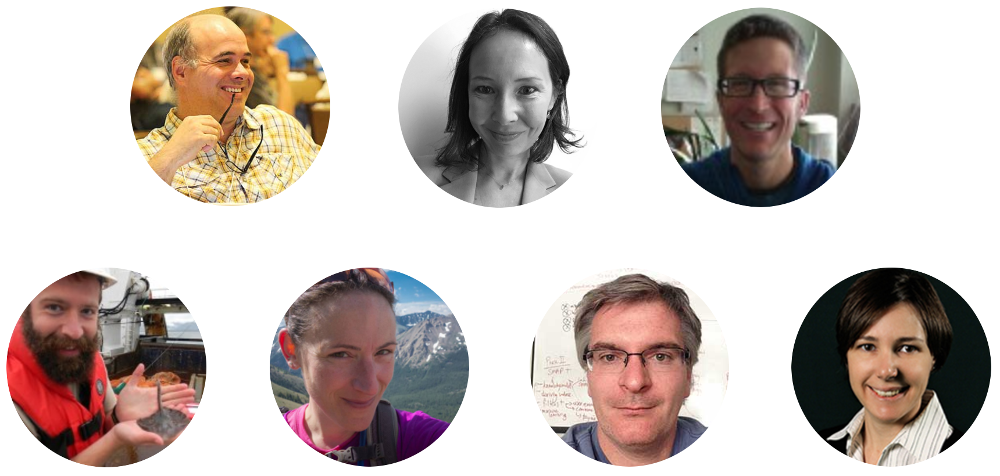

NCEAS Synthesis
========================================================
title: true

### Ecology of Infectious Disease
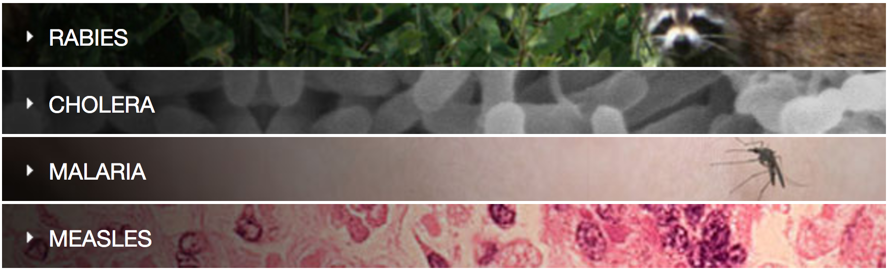

### Climate Effects
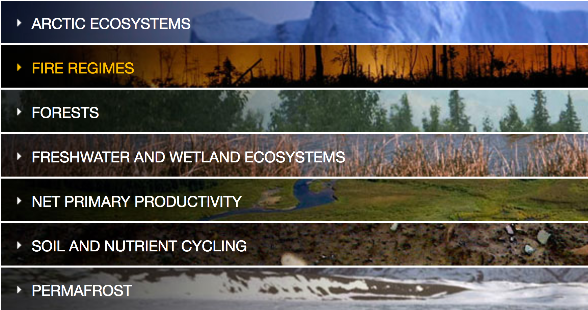

***
### Threats and Population Declines
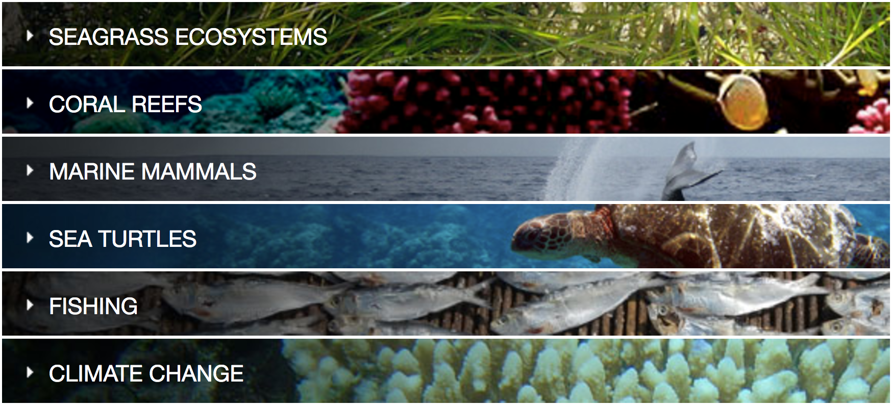

### Understanding Ocean Health
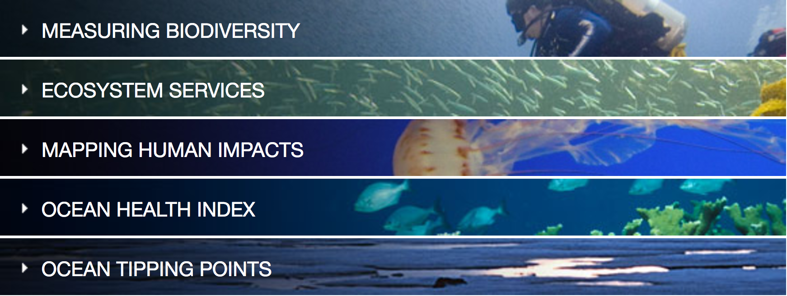

Ocean Health Index
========================================================

## Science

<strong>An index to assess the health and benefits of the global ocean</strong>
Halpern et al. Nature, (30 August 2012) DOI: [10.1038/nature11397](http://doi.org/10.1038/nature11397)

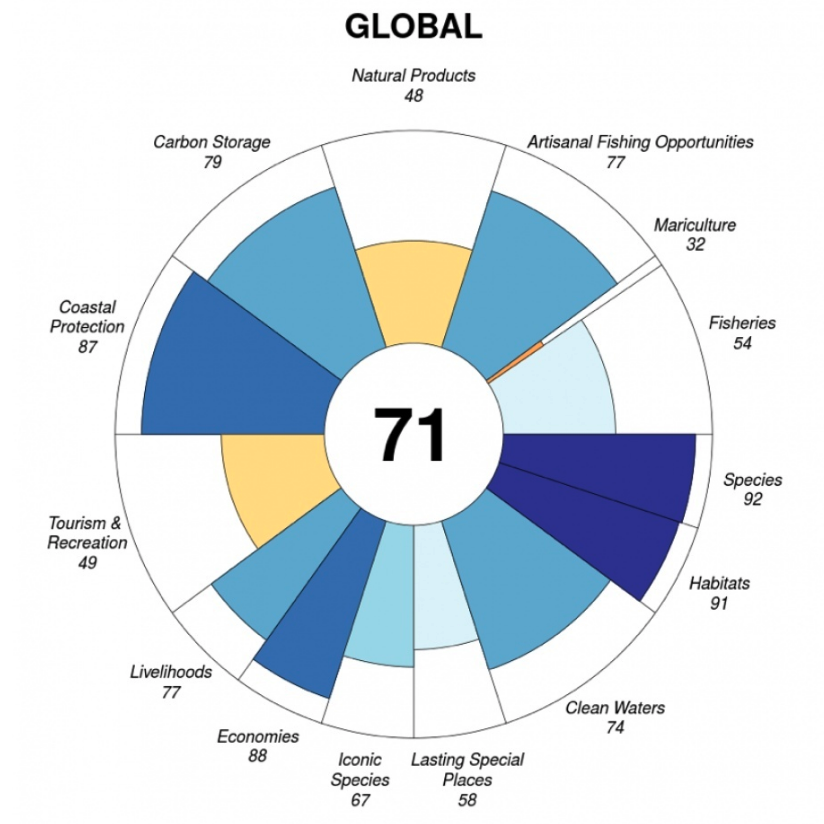

***
## Data
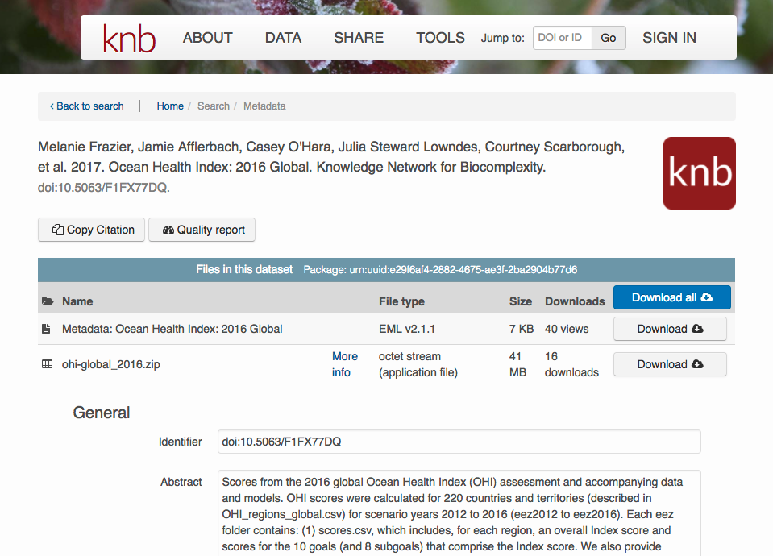

## Software
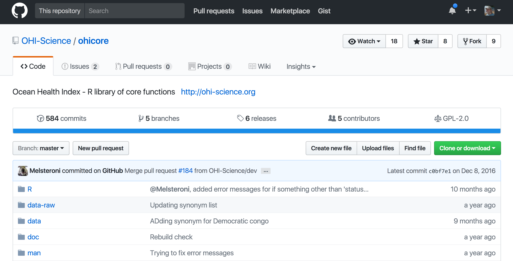

Synthesis in the Gulf Research Program
========================================================

- Environment
- Energy
- Health

***

- Natural systems
- Human societies
- Engineered systems

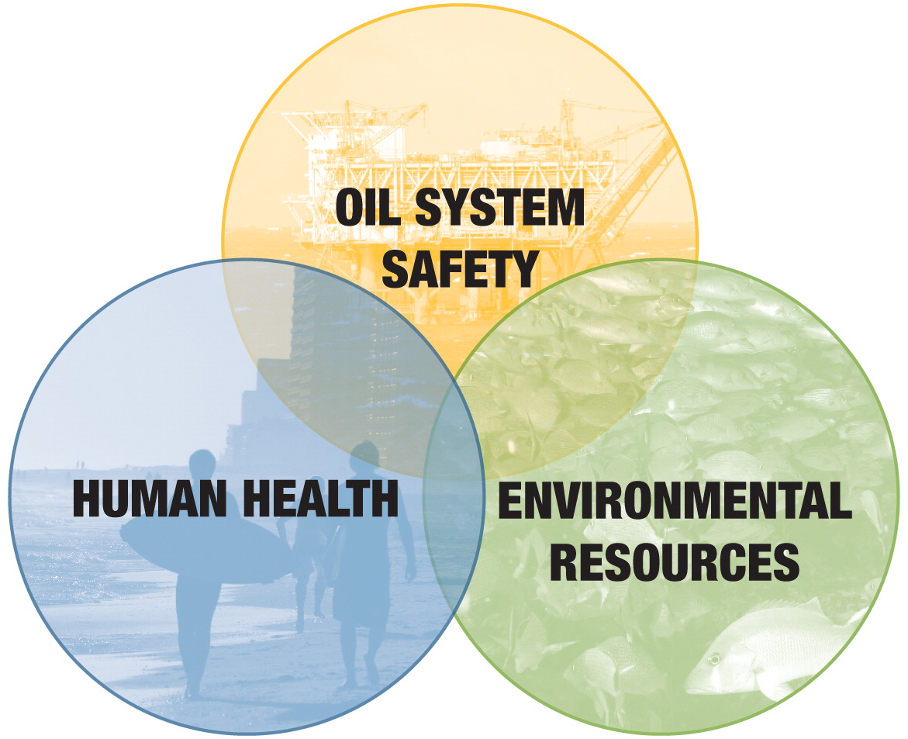

Introductions
========================================================

- 30 seconds: <strong>Name, brief bio, project interests</strong>
- Software you love, or love to hate

<video id="Oliver" controls src="https://www.nceas.ucsb.edu/~jones/oliver-noooo-excel-snippet-web.mp4"></video>

Synthesis Skills
========================================================
title: false

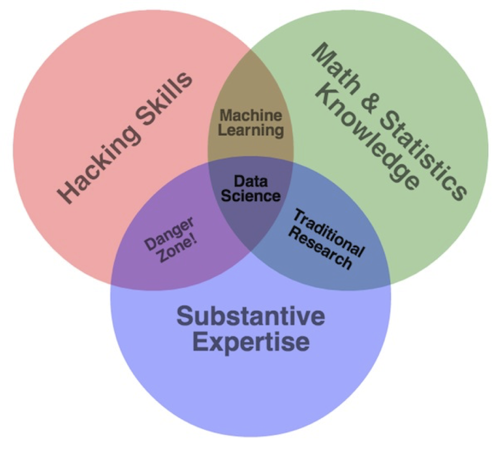

Course Topics
========================================================

- Collaboration modes and technologies, virtual collaboration
- Data management, preservation, and sharing
- Data manipulation, integration, and exploration
- Scientific workflows and reproducible research
- Programming using agile and sustainable software practices
- Data analysis and modeling
- Communicating results to broad communities

Curriculum
========================================================

## Week 1: Fundamental data and collaboration skills
Introduction to command line, communicating science, R, meta-analysis and data management.

## Week 2: Towards efficient and reproducible research
Tabular data, reproducible research and coding, and metagenomics.

## Week 3: Advanced topics & group projects
Communication, geospatial analysis, data viz, and synthesis project results.

View the [Full Schedule](https://nceas.github.io/oss-2017/schedule.html)

Communications
========================================================

## Slack

- https://slack.nceas.ucsb.edu, Channel #oss
- Daily discussion
- Questions, comments, additional links
- We will create channels for each of the synthesis projects as well

## Parking Lot

- https://github.com/NCEAS/oss-2017/labels/ParkingLot
- Running issues that we need to resolve
    - Especially if off-topic, or lengthy discussion
- Add anything you’d like addressed
- Create one issue per discussion item
- We'll review each morning

Daily Schedule
========================================================

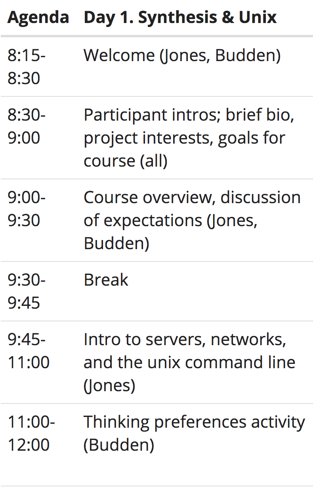
***
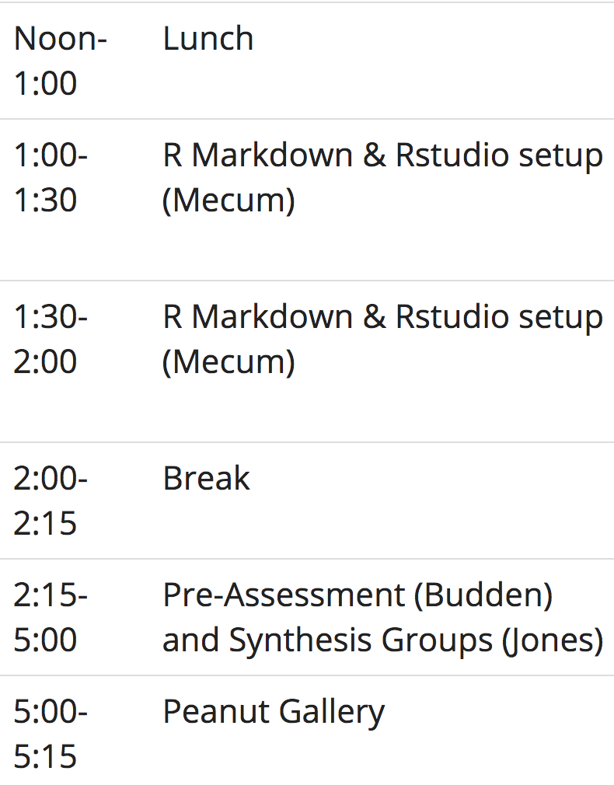

Course materials and resources
========================================================

## Course materials will be downloadable

- Lessons and code examples: https://nceas.github.io/oss-2017/lessons.html
    - Plus raw source code in GitHub: https://github.com/NCEAS/oss-lessons
- Reading list by day: https://nceas.github.io/oss-2017/readings.html

 

## Peanut Gallery

- Your time to {comment, question, dance, sing, discuss, act, joke, play, ...}
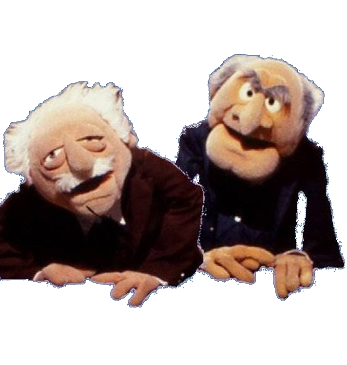

Code of Conduct
========================================================

- Governs our interactions
- Collaborative Community Document
    - http://bit.ly/OSSGRP-CoC

Acknowledgements
=========================================================

OSS2017 was funded under a grant from the [Gulf Research Program, National Academy of Sciences](http://www.nationalacademies.org/gulf/index.html)

 This work is licensed under a Creative Commons Attribution 4.0 International License.

