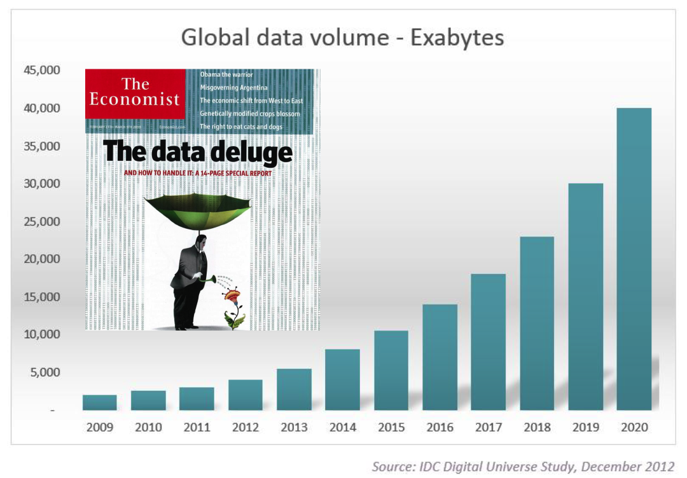
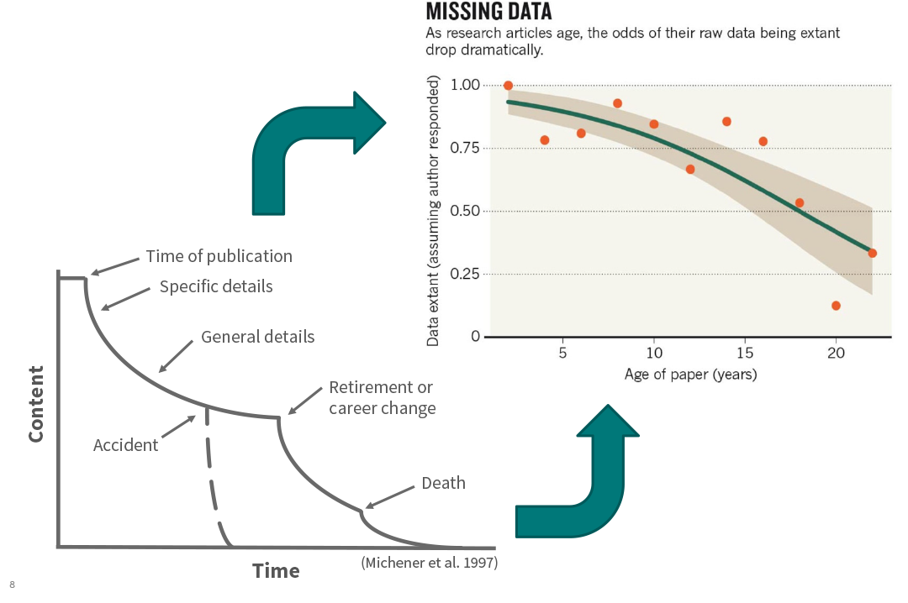
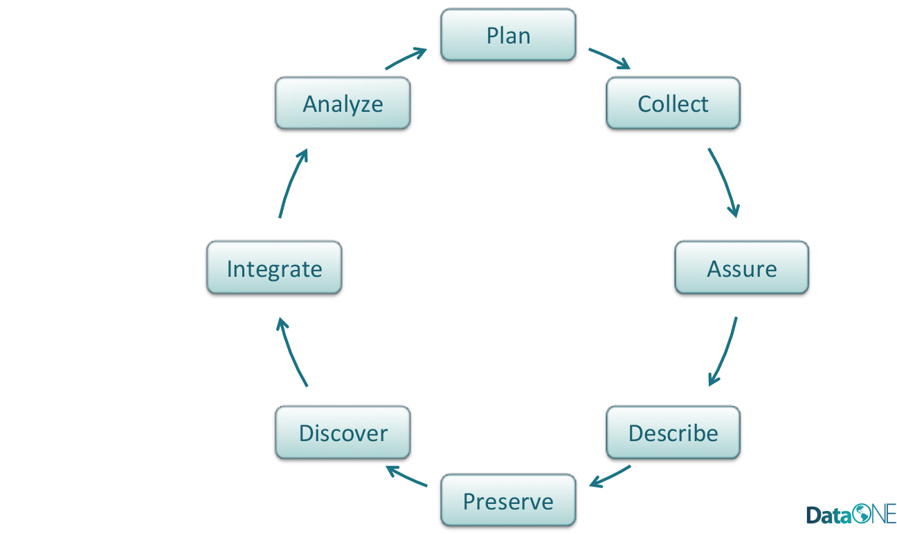
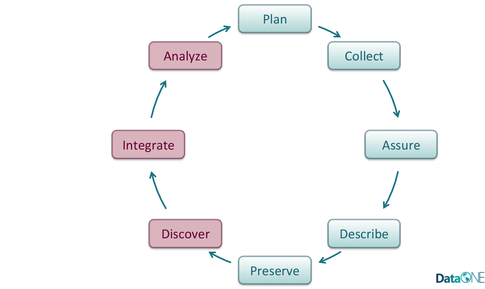

Data Management
========================================================
width: 1440
height: 900
font-family: 'Gill Sans', 'Source Sans Pro', 'Aller', 'Helvetica'
css: ../course-overview/oss.css

# And Data Repositories

The Need for Data Management: Big Data
========================================================

The Need for Data Management: Data Deluge
========================================================

The Need for Data Management: Data Entropy
========================================================
  

The Data Life Cycle
========================================================
 

The Data Life Cycle
========================================================
 

