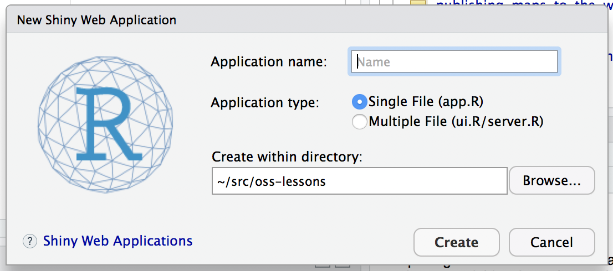

```{r, echo = FALSE}
knitr::opts_chunk$set(echo = FALSE, message = FALSE, warning = FALSE)
```

## Overview

Shiny is an R package for creating interactive data visualization explorations that you and your colleagues can visit in their web browser without installing anything.
The convenience this affords is priceless when we want to share and let others explore our data and analyses.

There are some really great examples of what Shiny can do on their webite like [this one](http://shiny.rstudio.com/gallery/movie-explorer.html).

## Lesson

We're going to create a simple shiny app with two sliders so we can interactively control inputs to an R function.
This extends our work done earlier in this course so we're going to start where we left off with our inverse distance weighting exercise and turn the static plot we made at the end into an interactive graphic.

Steps:

- Get students to reorient themselves to the data from tuesday

    Link is https://figshare.com/articles/OSS_data_-_2017_monday/5136289
- File > New > Shiny Web App...
- Set some fields:
    
    
    - Name it "myapp" or something else
    - Select "Single File"
    - Choose to create it where we were working yesterday:
        e.g. setwd("~/Documents/oss/oss2017data") 
        or whereever you were working
    - Click Create
- Run through the steps we can use to create what's in [./idw_app.R](./idw_app.R)

## Resources

- [Main site](http://shiny.rstudio.com/)
- [Official Shiny Tutorial](http://shiny.rstudio.com/tutorial/)
