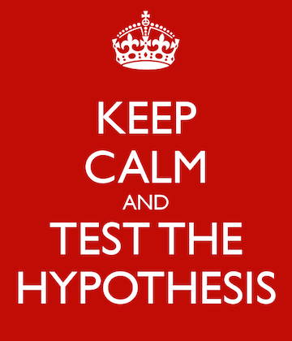
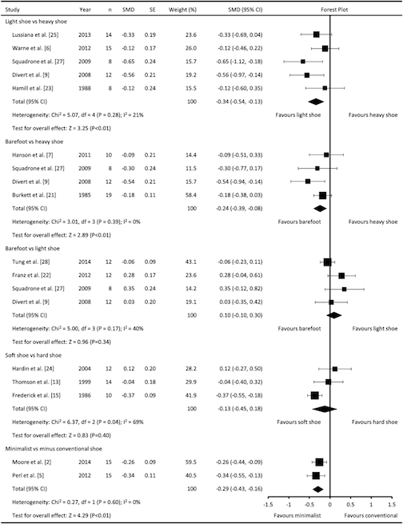

---
title: 
author: "cjlortie"
date: "2017"
output:
  html_document:
    theme: yeti
    toc: yes
    toc_depth: 3
    toc_float: yes
  pdf_document:
    toc: yes
---

###Zen and the art of scientific synthesis
[Fun deck describing a philosophy of synthesis](https://www.slideshare.net/cjlortie/zen-the-art-of-scientific-synthesis)  

[A brief description of the philosophy](http://onlinelibrary.wiley.com/doi/10.1111/oik.03161/full)  

 
     
 

###Rationale
Summary publications on best practices and approaches to meta-analyses and systematic reviews continue to proliferate for natural scientists in particular including a recent [handbook](http://press.princeton.edu/titles/10045.html). Transparency in reporting is still critical and often largely underdeveloped in the original submission of many syntheses in science. Repeatability and delineation of selection criteria are significant advantages of formalized synthesis and just good open science practices (for instance the work of the [Open Science Framework](https://osf.io/tvyxz/wiki/home/). A [PRISMA report](www.prisma-statement.org) and appendix listing all studies including those excluded are important resources and facile contributions to this end. Ideally, the descriptive dataset from the synthesis (studies, criteria and key bibliometric elements of each publication) can also be published *a priori* in an online repository that provides a DOI and cited as a dataset within the manuscript. Editors and referees alike have posited sample size challenges in the peer-review process. There is no magic number in the number of studies or independent instances from within a set of studies that examine the processes or hypothesis in review. However, cursory trends indicate that at least 10–15 studies are needed to warrant a synthesis and that independent instances from a set of studies often begin upwards of 30 tests for the submissions to date. A more productive way to frame meta-analytic sample sizes is the definition of the search. The framework of concepts should ensure that a broad enough set of terms capture both the primary purpose of the review and potentially related terms. Sensitivity analyses and checks of more than one bibliometric search tool are also appropriate. Readership likely also best relates to a balance point within the synthesis that mitigates increasing specialization in the sciences [(trends listed herein](http://onlinelibrary.wiley.com/doi/10.1111/j.1600-0706.2013.00970.x/full) but still provides sufficient evidence to effectively examine the topic at hand. More is not necessarily better either as a very broad synthesis including close to a 1000 studies or more from queries can produce challenges in assigning appropriate ecological context, defining and identifying subgroups, and scope of implications. The purpose of ALL meta-analysis or systematic reviews should nonetheless be explicit. Statement of purpose is more powerful than a question, but it is recommended that these syntheses not go as far as stating that they have the capacity to direct test a hypothesis.  

 

  

 

Typically, these syntheses explore the strength of evidence for a set of hypotheses and predictions and themselves thus have a purpose and outcome. Meta-analyses are often successful at this scale of exploration versus primary prediction or hypothesis testing terms. The meta-level can push testing to examination at larger-scales. This does not preclude critical scientific thinking, and the examination of implications, gaps, or theory development are powerful discovery tools. Systematic review versus meta-analysis is an increasingly common means to get up to speed in any (every) [discipline](http://www.sciencedirect.com/science/article/pii/S0966636215004993).  

 

  

 

###Terminology
Systematic reviews describe the meta-data of a field of research (who, where, why, how) whilst meta-analyses use the data directly (what was found). As stated previously, both are powerful synthesis tools (Lortie 2014), and the decision to report the literature landscape (systematic review) versus mean efficacy of a treatment or outcome across studies (meta-analysis) depends on both the purpose of the study and the reporting in the literature. Appropriate statistics have been a limited challenge in science for this set of synthesis tools. The rule-of-thumb has been that primary big data, collected identically can sometimes be treated with conventional statistics such as generalized linear models, but data from different studies must be treated with meta-analytics to control for between-study variation. Creativity in terms and concepts has been high at Oikos for all submissions and clearly a process of discovery for each sub-discipline. These discoveries can however be more extensively communicated in all these syntheses because they will inform future efforts and illuminate the extent that semantic development is needed for ecologists as a whole.

  

 

###Workflow
**Purpose:** To examine meta-analysis as a tool for scientific synthesis. This workshop will include a workflow from primary literature compilation to meta-analysis.

**To read or not to read**
Meta-analysis is a powerful scientific synthesis tool.
The first step to be able to critically read and assess their relative merits because of their increasing frequency in most domains of evidence-based inquiry. Here is a short ['how-to' read](http://onlinelibrary.wiley.com/doi/10.1002/jrsm.1109/abstract) meta-analyses.

**Learning outcomes:**  
1. To appreciate the value of formal scientific syntheses of primary research literature.  
2. To understand the difference between a systematic review and meta-analysis.  
3. To be able to do a reproducible literature search and filter.  
4. To be able to calculate appropriate effect size measures.  
5. To be able to visualize and contrast with versus between study effect size variation in R (for derived data) and in effect do a meta-analysis.  

 

**Steps:**  
1. Search   
2. Sort   
3. Synthesize   
4. Summarize   
5. Statistics   

**Open science products:**  
Search matrix listing frequencies  
PRISMA report  
A compiled, derived dataset  
Code and workflow summarizing data (i.e. effect sizes and variances)  
Code to visualize and model data (i.e.  meta-stats)  

