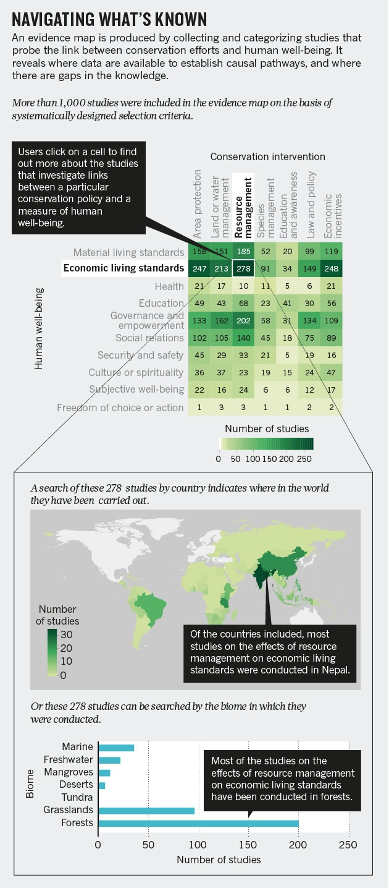

<br>
     
<br>

###Step 4. Summarize  
This is the abridge, condense, and aggregate step in an open science workflow for meta-analysis syntheses. The recap of the data is important to ensure it is correct and coherent. To summarize, it is useful to assess whether the specific set of studies is representative of the purpose of the synthesis. This is primarily a quantitative process, but there is a qualitative element (not in excluding studies or weighting evidence) in applying judgement. Studies that remain for synthesis are not necessarily the 'best' because some studies do not report data, used dramatically different methodologies, or only indirectly support the field of research and as such were not retained in the literature set. The goal of the summarize step is to recap the data and thus simplify the data to ensure it is telling (or about) the right scientific story. Primarily, this process does not model fitting or formal meta-statistics. The data are used to explore the [five Ws](https://en.wikipedia.org/wiki/Five_Ws) at this step using conventional approaches.

###Open science product
The primary open science research product is an 'evidence map' in some form that describes the what, who, where, when, and why of the research topic. Select the strongest and most important aspect to share and consider publishing this as a stand-alone open science product. Fighshare is an excellent repository for figures and provide a DOI.

###Case study  
In many of the global synthesis efforts within the natural sciences, where the research was done and the relative frequency of study is important. [Here](http://www.nature.com/news/sustainability-map-the-evidence-1.18962) is a recent call to action for literal maps of evidence as a powerful and compelling synthesis tool. Evidence maps can take many forms including bubble, box, and relative frequency plots to highlight the important Ws.

  
<br>

An important element of the graphic summarizing the data is that it addresses a principle question for the reader, and for you as the research synthesis jedi, the data viz should assesses the quality and fit of the data for the objective of the synthesis. Consequently, counts and data viz are not necessary for every W, but it is recommended that many be explored and some included in the appendices of the paper as a means to provide a topological summary of the dataset.

```{r summarize, warning=FALSE, message=FALSE}
library(tidyverse)
#Niche synthesis example####
#where
data <- read_csv("data/niche.data.csv")
data
require(maps)
world<-map_data("world")
map<-ggplot() + geom_polygon(data=world, fill="gray50", aes(x=long, y=lat, group=group))
map + geom_point(data=data, aes(x=long, y=lat)) #render a literal map, i.e. evidence map, of where we study the niche in deserts globally

#count up the why we study niche in deserts####  
#why

data.simple <- data %>% group_by(niche.concept, ecosystem) %>% count()

ggplot(na.omit(data.simple), aes(niche.concept, n, fill = ecosystem)) + geom_bar(stat = "identity") + coord_flip() + scale_fill_brewer(palette = "Blues")

```

###Exercise  
Explore the five Ws for your set of studies. To do this, produce an evidence map showing where the research was done, why the research was done, and even cursorily how the research was done (i.e. mensurative of manipulative). To complete the why and how, quickly review a total of 20 studies and code simply to begin. Then use frequency histograms, barplots, or another simple data viz mapping to explore whether this set of studies is representative of the field and corresponds with your expert personal knowledge of this domain. The purpose of the summary to recap and tell the story but also to assess landscape-level data quality. In this process, continue from the previous step to build the data frame and record whether effect size measures were listed in any of the primary studies. A critical component of the how studies were done is includes what was measure as the response because this influences the effect size meausure selected in the next step, statistic analysis.

###Conclusions
1. A summary of synthesis data is a powerful, relatively direct mechanism to provide a sense of the scope of research for a specific topic.  
2. A data summary is a recap of synthesis dataframe that highlights the main idea of the selection of studies.  
3. An excellent indicator of an appropriate synthesis fit is also an open science product.  
4. **Organizing ideas is just as important as organizing data**.  Consider using tools such as ontologies, conceptual frameworks, standard vocabularies, and heuristic idea mapping methodologies.

###Additional resources
[Evidence maps](https://systematicreviewsjournal.biomedcentral.com/articles/10.1186/s13643-016-0204-x) can take numerous forms.  

[Conceptual frameworks](http://onlinelibrary.wiley.com/doi/10.1111/geb.12202/full) summarizing the ideas are also an important outcome of the data summary process for synthesis data.  

[Here](http://onlinelibrary.wiley.com/doi/10.1111/j.1466-8238.2011.00713.x/abstract) is another conceptual framework from a less formal synthesis process but is nonetheless a powerful tool for inspiration. In doing these syntheses, other tools such as ontologies, conceptual frameworks, and standardizing the terminology within a field of research are a profound contribution.