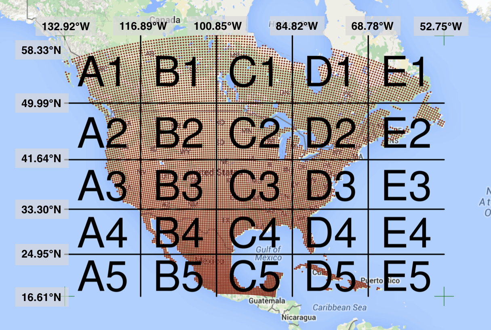
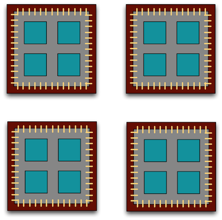

```{r setup, include=FALSE}
knitr::opts_chunk$set(echo = TRUE)
```

# Learning Outcomes

- Understand what parallel computing is and when it may be useful
- Understand how parallelism can work
- Review sequential loops and *apply functions
- Understand and use the `parallel` package multicore functions
- Understand and use the `foreach` package functions

# Introduction

Processing large amounts of data with complex models can be time consuming.  New types of sensing means the scale of data collection today is massive. And modeled outputs can be large as well.For example, here's a 2 TB (that's Terabyte) set of modeled output data from Ofir Levy et al. 2016 that models 15 environmental variables at hourly time scales for hundreds of years across a regular grid spanning a good chunk of North America:



There are over 400,000 individual netCDF files in the [Levy et al. microclimate data set](https://doi.org/10.5063/F1Z899CZ).  Processing them would benefit massively from parallelization.

Alternatively, think of remote sensing data.  Processing airborne hyperspectral data can involve processing each of hundreds of bands of data for each image in a flight path that is repeated many times over months and years.  


# Why parallelism?

Much R code runs fast and fine on a single processor.  But at times, computations
can be:

- **cpu-bound**: Take too much cpu time
- **memory-bound**: Take too much memory
- **I/O-bound**: Take too much time to read/write from disk
- **network-bound**: Take too much time to transfer

To help with **cpu-bound** computations, one can take advantage of modern processor architectures that provide multiple cores on a single processor, and thereby enable multiple computations to take place at the same time. In addition, some machines ship with multiple processors, allowing large computations to occur across the entire cluster of those computers. Plus, these machines also have large amounts of memory to avoid **memory-bound** computing jobs.

# Processors (CPUs) and Cores

A modern CPU (Central Processing Unit) is at the heart of every computer.  While
traditional computers had a single CPU, modern computers can ship with mutliple processors, which in turn can each contain multiple cores.  These processors and 
cores are available to perform computations.

A computer with one processor may still have 4 cores (quad-core), allowing 4 computations
to be executed at the same time.

 

A typical modern computer has multiple cores, ranging from one or two in laptops
to thousands in high performance compute clusters.  Here we show four quad-core
processors for a total of 16 cores in this machine.



You can think of this as allowing 16 computations to happen at the same time. Theroetically, your computation would take 1/16 of the time (but only theoretically, more on that later).

Historically, R has only utilized one processor, which makes it single-threaded.  Which is a shame, because the 2017 MacBook Pro that I am writing this on is much more powerful than that:

```{sh eval=FALSE}
jones@powder:~$ sysctl hw.ncpu hw.physicalcpu
hw.ncpu: 8
hw.physicalcpu: 4
```

To interpret that output, this machine `powder` has 4 physical CPUs, each of which has
two processing cores, for a total of 8 cores for computation.  I'd sure like my R computations to use all of that processing power. Now let's look at
the computational server `aurora` at NCEAS:

```{sh eval=FALSE}
jones@aurora:~$ lscpu | egrep 'CPU\(s\)|per core|per socket'
CPU(s):                88
On-line CPU(s) list:   0-87
Thread(s) per core:    2
Core(s) per socket:    22
NUMA node0 CPU(s):     0,2,4,6,8,10,12,14,16,18,20,22,24,26,28,30,32,34,36,38,40,42,44,46,48,50,52,54,56,58,60,62,64,66,68,70,72,74,76,78,80,82,84,86
NUMA node1 CPU(s):     1,3,5,7,9,11,13,15,17,19,21,23,25,27,29,31,33,35,37,39,41,43,45,47,49,51,53,55,57,59,61,63,65,67,69,71,73,75,77,79,81,83,85,87
```

Now that's some compute power!  Aurora has 384 GB of RAM, and ample storage.  But, maybe one of these NSF-sponsored high performance computing clusters (HPC) is what you need:

- [JetStream](https://jetstream-cloud.org/)
    - 640 nodes, 15,360 cores, 80TB RAM
- [Stampede2]() at TACC is coming online in 2017
    - 4200 nodes, 285,600 cores

# When to parallelize

It's not as simple as it may seem. While in theory each added processor would linearly increase the throughput of a computation, there is overhead that reduces that efficiency.  For example, the code and, importantly, the data need to be copied to each additional CPU, and this takes time and bandwidth.  Plus, new processes and/or threads need to be created by the operating system, which also takes time.  This overhead reduces the efficiency enough that realistic performance gains are much less than theoretical, and usually do not scale linearly as a function of processing power. For example, if the time that a computation takes is short, then the overhead of setting up these additional resources may actually overwhelm any advantages of the additional processing power, and the computation could potentially take longer!

In addition, not all of a task can be parallelized. Depending on the proportion, the expected speedup can be significantly reduced.  Some propose that this may follow [Amdahl's Law](https://en.wikipedia.org/wiki/Amdahl%27s_law), where the speedup of the computation (y-axis) is a function of both the number of cores (x-axis) and the proportion of the computation that can be parallelized (see colored lines):

```{r echo=FALSE}
library(ggplot2)
library(tidyr)
amdahl <- function(p, s) {
  return(1 / ( (1-p) + p/s  ))
}
doubles <- 2^(seq(0,16))
cpu_perf <- cbind(cpus = doubles, p50 = amdahl(.5, doubles))
cpu_perf <- cbind(cpu_perf, p75 = amdahl(.75, doubles))
cpu_perf <- cbind(cpu_perf, p85 = amdahl(.85, doubles))
cpu_perf <- cbind(cpu_perf, p90 = amdahl(.90, doubles))
cpu_perf <- cbind(cpu_perf, p95 = amdahl(.95, doubles))
#cpu_perf <- cbind(cpu_perf, p99 = amdahl(.99, doubles))
cpu_perf <- as.data.frame(cpu_perf)
cpu_perf <- cpu_perf %>% gather(prop, speedup, -cpus)
ggplot(cpu_perf, aes(cpus, speedup, color=prop)) + 
  geom_line() +
  scale_x_continuous(trans='log2') +
  theme_bw() +
  labs(title = "Amdahl's Law")
```


So, its important to evaluate the computational efficiency of requests, and work to ensure that additional compute resources brought to bear will pay off in terms of increased work being done.  With that, let's do some parallel computing...

# Loops and repetitive tasks using lapply

When you have a list of repetitive tasks, you may be able to speed it up by adding more computing power.  If each task is completely independent of the others, then it is a prime candidate for executing those tasks in parallel, each on its own core.  For example, let's build a simple loop that downloads and processes a set of data files.

```{r eval=FALSE}
library(httr)
sm_service <- "https://knb.ecoinformatics.org/knb/d1/mn/v2/meta/"
#get_service <- "https://knb.ecoinformatics.org/knb/d1/mn/v2/object/"
url_list <- c(
  "urn%3Auuid%3A5f74eb23-b704-4e2a-858c-f9806f5d701a",
  "urn%3Auuid%3A905026a6-ea91-47d3-b1b7-35991d82c58b")
res_list <- c()
for(current_url in url_list) {
  print(paste0("Processing: ", sm_service, current_url))
  #res <- GET(current_url)
  #res_list <- rbind(res_list, content(res))
}
str(res_list)
```

The issue with this loop is that each of the files is retrieved sequentially. Which means that only one of our 8 processors on this machine are in use.  In order to exploit parallelism, we need to be able to dispatch our tasks as functions, with one task
going to each processor.  To do that, we need to convert our task to a function, and then use the `*apply()` family of R functions to apply that function to all of the members of a set.  In R, using `apply` is often significantly faster than the equivalent code in a loop.  Here's the same code rewritten to use `lapply()`, which applies a function to each of the members of a list:

```{r eval=FALSE}
library(httr)
sm_service <- "https://knb.ecoinformatics.org/knb/d1/mn/v2/meta/"
#get_service <- "https://knb.ecoinformatics.org/knb/d1/mn/v2/object/"
url_list <- c(
  "urn%3Auuid%3A5f74eb23-b704-4e2a-858c-f9806f5d701a",
  "urn%3Auuid%3A905026a6-ea91-47d3-b1b7-35991d82c58b")
res_list <- c()
fx <- function(current_url) {
    print(paste0("Processing: ", sm_service, current_url))
    #res <- GET(current_url)
    #res_list <- rbind(res_list, content(res))
}
system.time(res <- lapply(url_list, fx) )
```

# Parallelize it!

The `parallel` library can be used to send tasks (encoded as function calls) to each of the processing cores on your machine in parallel.  This is done by using the `parallel::mclapply` function, which is analogous to `lapply`, but distributes the tasks to multiple processors. `mclapply` gathers up the responses from each of these function calls, and returns a list of responses that is the same length as the list or vector of input data (one return per input item).

```{r}
library(parallel)
library(MASS)

starts <- rep(100, 40)
fx <- function(nstart) kmeans(Boston, 4, nstart=nstart)
numCores <- detectCores()
numCores

system.time(
  results <- lapply(starts, fx)
)

system.time(
  results <- mclapply(starts, fx, mc.cores = numCores)
)
```

# Parallelization using: foreach

The normal `for` loop in R looks like:

```{r}
for (i in 1:3) {
  print(sqrt(i))
}
```

The `foreach` method is similar, but uses the sequential `%do%` operator to indicate an expression to run. Note the difference in the returned data structure. 
```{r}
library(foreach)
foreach (i=1:3) %do% {
  sqrt(i)
}
```

In addition, `foreach` supports a parallelizable operator `%dopar%`, which allows each iteration through the loop to use different cores or different machines in a cluster.  Here, we demonstrate with using all the cores on the current machine:
```{r}
library(foreach)
library(doParallel)
registerDoParallel(numCores)  # use multicore, set to the number of our cores
foreach (i=1:3) %dopar% {
  sqrt(i)
}

# To simplify output, foreach has some parameters that can simplify return values

# Return a vector
foreach (i=1:3, .combine=c) %dopar% {
  sqrt(i)
}

# Return a data frame
foreach (i=1:3, .combine=rbind) %dopar% {
  sqrt(i)
}

# When you're done, clean up the cluster
stopImplicitCluster()
```

# Readings and tutorials

- [Multicore Data Science with R and Python](https://blog.dominodatalab.com/multicore-data-science-r-python/)
- [Beyond Single-Core R](https://ljdursi.github.io/beyond-single-core-R/#/) by Jonoathan Dursi (also see [GitHub repo for slide source](https://github.com/ljdursi/beyond-single-core-R))
- The venerable [Parallel R](http://shop.oreilly.com/product/0636920021421.do) by McCallum and Weston (a bit dated on the tooling, but conceptually solid)

