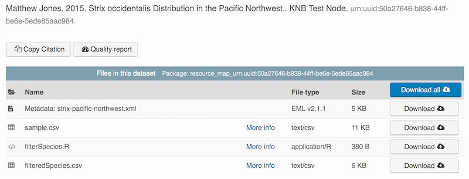

## Introduction
  
This document describes how to use the *dataone* R package to upload data to DataONE.

The *dataone* R package provides methods to enable R scripts to interact with DataONE Coordinating Nodes (CN) and Member Nodes (MN), to search for, download, upload and update data and metadata. The *dataone* R package takes care of 
the details of calling the  corresponding DataONE web service on a DataONE node. For example, the *dataone* 
`createObject` R method calls the DataONE web service [MNStorage.create()](https://purl.dataone.org/architecture/apis/MN_APIs.html#MNStorage.create) that uploads a dataset to a DataONE MN. 

## Logging in
Before uploading any data to a DataONE MN, it is necessary to obtain a DataONE user identity that will
be provided with each request to upload or update data. The method that DataONE uses
requires an *authentication token*, which is a character string, to be provided during upload. This token can be retrieved by logging into the DataONE network and copying the token into your R session.  

### Obtain an ORCID
ORCID is a researcher identifier that provides a common way to link your researcher identity to your articles and data.  An ORCID is to a researcher as a DOI is to a research article.  To obtain an ORCID, register at https://orcid.org.

### Log in to DataONE
We will be using a test server, so login and retrieve your token at https://search-stage-2.test.dataone.org.

Once you are logged in, navigate to your Profile Settings, and locate the "Authentication Token" section, and then copy the token for R to your clipboard.

## Modify metadata
Next, modify the metadata file associated with the package to set yourself as the owner.  This will help us differentiate the test data later.  Open the `strix-pacific-northwest.xml` file in RStudio, and change the `givenName` and `surName` fields at the top to your name.

```{r}
library(EML)
# devtools::install_github("NCEAS/arcticdatautils")
library(arcticdatautils)

# Load the EML file into R
emlFile <- "strix-pacific-northwest.xml"
doc <- read_eml(emlFile)

# Change creator to us
doc@dataset@creator <- c(eml_creator("Matthew", "Jones", email = "jones@nceas.ucsb.edu"))

# Change abstract to the better one we wrote
doc@dataset@abstract <- as(set_TextType("better-abstract.md"), "abstract")

# Save it back to the filesystem
write_eml(doc, "strix-pacific-northwest.xml")
```

## Uploading A Package Using `uploadDataPackage`
Datasets and metadata can be uploaded individually or as a collection. Such a collection, whether contained in local 
R objects or existing on a DataONE repository, will be informally referred to as a `package`. The steps necessary to
to prepare and upload a package to DataONE using the `uploadDataPackage` method 
will be shown. A complete script that uses these steps is shown here.

In the first section, we create a 'DataPackage as a container for our data and metadata and scripts:

```{r}
library(dataone)
library(datapack)
library(uuid)

d1c <- D1Client("STAGING2", "urn:node:mnTestKNB")
dp <- new("DataPackage")
show(dp)
```

We then add a metadata file, data file, R script and output data file to this package:
```{r}
# Generate identifiers for our data and program objects, and add them to the metadata
sourceId <- paste0("urn:uuid:", uuid::UUIDgenerate())
progId <- paste0("urn:uuid:", uuid::UUIDgenerate())
outputId <- paste0("urn:uuid:", uuid::UUIDgenerate())
doc@dataset@otherEntity[[1]]@id <- new("xml_attribute", sourceId)
doc@dataset@otherEntity[[2]]@id <- new("xml_attribute", progId)
doc@dataset@otherEntity[[3]]@id <- new("xml_attribute", outputId)
repo_obj_service <- paste0(d1c@mn@endpoint, "/object/")
doc@dataset@otherEntity[[1]]@physical[[1]]@distribution[[1]]@online@url <- 
  new("url", paste0(repo_obj_service, sourceId))
doc@dataset@otherEntity[[2]]@physical[[1]]@distribution[[1]]@online@url <- 
  new("url", paste0(repo_obj_service, progId))
doc@dataset@otherEntity[[3]]@physical[[1]]@distribution[[1]]@online@url <- 
  new("url", paste0(repo_obj_service, outputId))

write_eml(doc, "strix-pacific-northwest.xml")

# Add the metadata document to the package
metadataObj <- new("DataObject", 
                   format="eml://ecoinformatics.org/eml-2.1.1", 
                   filename=paste(getwd(), emlFile, sep="/"))
dp <- addMember(dp, metadataObj)

# Add our input data file to the package
sourceData <- "sample.csv"
sourceObj <- new("DataObject",
                 id = sourceId,
                 format="text/csv", 
                 filename=paste(getwd(), sourceData, sep="/"))
dp <- addMember(dp, sourceObj, metadataObj)

# Add our processing script to the package
progFile <- "filterSpecies.R"
progObj <- new("DataObject",
               id = progId,
               format="application/R", 
               filename=paste(getwd(), progFile, sep="/"), 
               mediaType="text/x-rsrc")
dp <- addMember(dp, progObj, metadataObj)

# Add our derived output data file to the package
outputData <- "filteredSpecies.csv"
outputObj <- new("DataObject", 
               id = outputId,
               format="text/csv", 
               filename=paste(getwd(), outputData, sep="/"))
dp <- addMember(dp, outputObj, metadataObj)

myAccessRules <- data.frame(subject="http://orcid.org/0000-0003-0077-4738", permission="changePermission") 

# Add the provenance relationships to the data package
dp <- describeWorkflow(dp, sources=sourceObj, program=progObj, derivations=outputObj)

show(dp)
```

Finally, we upload the package to the Testing server for the KNB.
```{r, eval=FALSE}
packageId <- uploadDataPackage(d1c, dp, public=TRUE, accessRules=myAccessRules, quiet=FALSE)
```

This particular package contains the R script `filterSpecies.R`, the input 
file `sample.csv` that was read by the script and the output file 
`filteredSpecies.csv` that was created by the R script, which was run at a
previous time.  

You can now search for and view the package at https://dev.nceas.ucsb.edu:



In addition, each of the uploaded entities shows the relevant provenance information, showing how the source data is linked to the derived data via the R program that was used to process the raw data:


