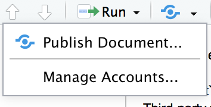

## Introduction

Making maps is something just about all of us have to do at some point but we're often making static maps (i.e. JPEG, PNG, PDF, etc.).
Interative maps (think Google Maps) have become very popular on news sites and in all kinds of reporting, including science reporting.
Take the NYTimes for example:

http://www.nytimes.com/projects/elections/2013/nyc-primary/mayor/map.html

These are really great ways to vizualize our spatial data.
It turns out we can actually create these kinds of maps entirely from within R!

## Learning objectives

After completing this lesson, students will:

- Understanding how to use the  `leaflet` package
- Have made a multi-layer map with `leaflet`
- Have published their `leaflet` map to the web

## Lesson

[`leaflet`](https://rstudio.github.io/leaflet/) is a package maintained by RStudio that gives us access to the popular [Leaflet](http://leafletjs.com/) library which is a feature-packed alternative to Google Maps for making interactive maps for the web.

```{r}
library(leaflet)

m <- leaflet() %>%
  addTiles() %>%  # Add default OpenStreetMap map tiles
  addMarkers(lng = -119.7000545, lat = 34.419271, popup = "Where we are right now!")

m  # Print the map
```

### The `leaflet` function

`leaflet` can plot a lot of different kinds of things for us, including:

- From base R:
    - lng/lat matrix
    - data frame with lng/lat columns
- From the `sp` package:
    - SpatialPoints[DataFrame]
    - Line/Lines
    - SpatialLines[DataFrame]
    - Polygon/Polygons
    - SpatialPolygons[DataFrame]
- From the `maps` package:
    - the data frame from returned from map()

A lot of our data will be in either a shapefile or CSV so we're good to go without any extra work.
If you pass in a data.frame with columsn like lat/latitude and lng/long/longitude, the lat and lon columns are guessed at which is really nice.

### Third-party tiles

`leaflet` defaults to using OpenStreetMap's awesome vector tiles but we can use our own if we want.
You may want to use custom tiles if you either:

- Have custom maps produced by your (or another) organization that show details you need (e.g. aerial photos)
- Want to use a stylized tile layer for aesthetic reasons

There are plenty of custom tile layers out there, but here's an awesome example provided by the `leaflet` documentation showing how to overlay Nexrad data on top of OSM tiles:

```{r}
leaflet() %>% 
  addTiles() %>% 
  setView(-93.65, 42.0285, zoom = 4) %>%
  addWMSTiles(
    "http://mesonet.agron.iastate.edu/cgi-bin/wms/nexrad/n0r.cgi",
    layers = "nexrad-n0r-900913",
    options = WMSTileOptions(format = "image/png", transparent = TRUE),
    attribution = "Weather data © 2012 IEM Nexrad"
  )
```

### Markers

Makers pin points on your map and we use the `addMarkers` function to do so:

```{r}
npoints <- 20
gom <- list("lat" = 28, "lng" = -89) # Near the center of the Gulf of Mexico

points_in_gom <- data.frame(latitude = runif(npoints, gom$lat - 2, gom$lat + 2),
                            longitude = runif(npoints, gom$lng - 7, gom$lng + 7),
                            label = 1:npoints)

leaflet(points_in_gom) %>%
  addTiles() %>%
  addMarkers(~longitude, ~latitude, popup = ~as.character(label)) 
```

If we don't want blue pins, we can use any image we have.
See https://rstudio.github.io/leaflet/markers.html.

```{r}
url = "https://github.com/NCEAS/oss-lessons/raw/gh-pages/publishing-maps-to-the-web-in-r/images/ship.png"
ship = makeIcon(url, url, 24, 24)

leaflet(points_in_gom) %>%
  addTiles() %>%
  addMarkers(~longitude, 
             ~latitude, 
             popup = ~as.character(label),
             icon = ship) 
```

### Lines and shapes

`leaflet` supports lines and polygons (arbitrary, or simple ones like rectangles).

```{r}
library(rgdal)

states <- readOGR("data/cb_2016_us_state_20m/cb_2016_us_state_20m.shp",
                  layer = "cb_2016_us_state_20m", GDAL1_integer64_policy = TRUE)

gom_states <- subset(states, states$STUSPS %in% c(
  "TX", "LA", "MS", "AL", "GA", "FL"
))

m <- leaflet(gom_states) %>%
  addTiles() %>% 
  addPolygons(color = "#444444", weight = 1, smoothFactor = 0.5,
              opacity = 1.0, fillOpacity = 0.5,
              fillColor = ~colorQuantile("YlOrRd", ALAND)(ALAND),
              highlightOptions = highlightOptions(color = "white", weight = 2,
                                                  bringToFront = TRUE))
m
```

Let's create some fake data on catch per unit effort (CPUE):

```{r}
npoints <- 20
gom <- list("lat" = 28, "lng" = -89) # Near the center of the Gulf of Mexico

cpue_data <- data.frame(latitude = runif(npoints, gom$lat - 2, gom$lat + 2),
                        longitude = runif(npoints, gom$lng - 7, gom$lng + 7),
                        cpue = rpois(npoints, 20))

m <- leaflet(cpue_data) %>% 
  addTiles() %>%
  addCircles(lng = ~longitude, 
             lat = ~latitude, 
             weight = 1, 
             radius = ~ sqrt(cpue) * 1e4, 
             popup = ~ as.character(cpue))

m
```

### Legends

`leaflet` makes putting a legend on our map really simple.
We just need to create a palette and use `addLegend`:

```{r}
pal <- colorNumeric(
  palette = "YlOrRd",
  domain = gom_states$ALAND
)

m <- leaflet(gom_states) %>%
  addTiles() %>% 
  addPolygons(color = "#444444", weight = 1, smoothFactor = 0.5,
              opacity = 1.0, fillOpacity = 0.5,
              fillColor = ~colorQuantile("YlOrRd", ALAND)(ALAND),
              highlightOptions = highlightOptions(color = "white", weight = 2,
                                                  bringToFront = TRUE)) %>% 
  addLegend("topright", 
            pal = pal, 
            values = ~ALAND,
            title = "Land area",
            labFormat = labelFormat(suffix = " sqkm"),
            opacity = 1
)

m
```

### Showing / hiding layers

We can make each of our layers uncheckable so the user can pick and choose which layers they are viewing.
Each layer's function (e.g. `addMarker`) just needs to get a `group` argument and then we use the `addLayersGroup` function.

```{r}
m <- leaflet(cpue_data) %>% 
  addTiles() %>%
  addCircles(lng = ~longitude, 
             lat = ~latitude, 
             weight = 1, 
             radius = ~ sqrt(cpue) * 1e4, 
             popup = ~ as.character(cpue),
             group = "CPUE Data") %>% 
  addLayersControl(
    overlayGroups = c("CPUE Data"),
    options = layersControlOptions(collapsed = FALSE)
  )

m
```

### Zooming / panning


```{r}
# Save the lat/lon pair so we don't repeat ourselves
nceas <- list("lon" = -119.7000545, "lat" = 34.419271)

m <- leaflet() %>%
  addTiles() %>%  # Add default OpenStreetMap map tiles
  addMarkers(lng=nceas$lon, lat=nceas$lat, popup = "Where we are right now!") %>% 
  setView(lng = nceas$lon, lat = nceas$lat, zoom = 16)

m
```

**Exercise: Change the default center and zoom level to where you live or work**

Tip: The `ggmap` package can tells us where things are:

```{r}
library(ggmap)
geocode("Juneau, AK")
```

```{r}
# Your code here
```


### Publishing it

RStudio has built-in integration with their RPubs service which offers free hosting of your knitted Rmd files.
Let's publish the full map we made to RPubs.
The full map is in this lesson's folder under map.Rmd.

- Open map.Rmd
- Click the publish button in the Source pane:

    
- Create an account and log in with your credentials if you don't have them already

## Other resources

- https://rstudio.github.io/leaflet
- https://earthdatascience.org/course-materials/earth-analytics/week-10/leaflet-r/