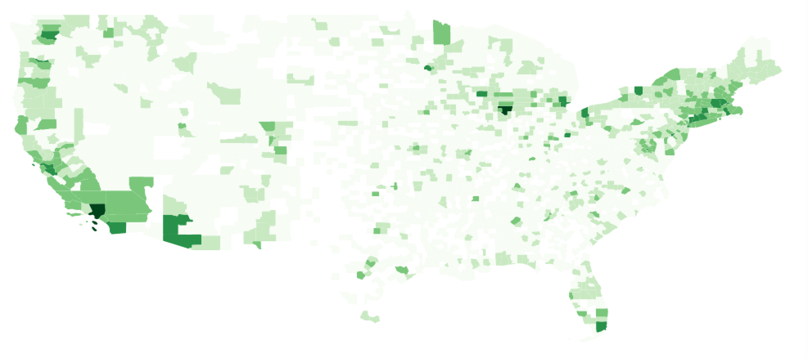

Quantum GIS
============

# QGIS is...

### (a.k.a., "what ArcGIS isn't")

* Cross-platform
* Open source
* Free

QGIS is a good tool to explore your geospatial data and conduct geospatial processing and analysis. It is also possible to script QGIS analysis in Python.

# Visualize and explore spatial data

* Load raster, vector, and delimited coordinate data
* Adjust colors, symbols, transparency
* Select features, measure distances, and more

# Make maps

* Design map layouts
* Add legend, scale bar, labels, images

# Create data

* Digitize, edit, and save data

# Harness greater powers

* Interface to GRASS GIS
    - Full-fledged analytical GIS environment
* Run many GDAL/OGR utilities
    - Swiss army knife for geospatial data

  

# Challenge

#### _Goal:_ Count the number of farmers market in each contiguous US county

Note: this challenge has been built using QGIS 2.14.3

You can find in the `qgis-handson` directory a csv file with all the farmers market locations in the US.

1. We need to transform this csv into a shapefile. This will require to define the projection. Assuming the locations has been taken with a GPS, can you guess what projection this data are using?
3. Add the shapefile of the US counties
4. Use the `count points in polygon` tool `Vector -> Analysis Tool` to compute the number of points in each county.
5. What does the error message suggest? Check the projection of the counties? What is the problem?
6. Reproject the farmers market shapefile by saving the layer
7. Compute the number of points per county
8. Create a choropleth map of the number of farmers market
9. Don't forget the legend and scale!

