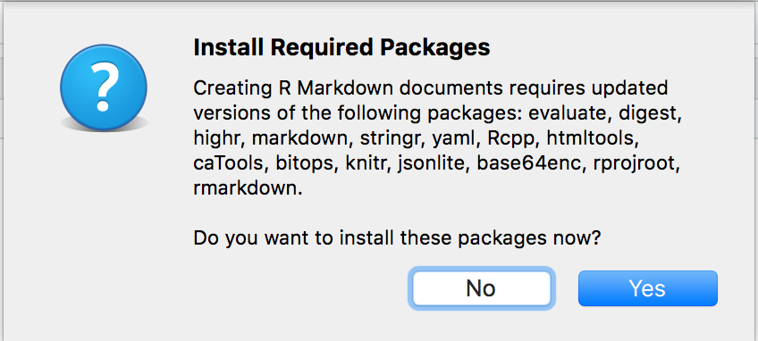

## Introduction

Plain text is a great way to write information down. Plain text has some major advantages:

- Works regardless of what decade you're trying to read the file, i.e. computers have and will continue to speak plain text but MS Word formats will continue to be a pain in the neck forever
- Works perfectly with version control software like git. MS Word does not.
- Easy to read, easy to write

Markdown is a plain text format that allows for common typesetting features including:

- Text formatting (bold, italic, etc.)
- Links
- Tables
- In-lined images

Without the need for spending time typesetting which is tedious and usually unnecessary.
So if we want those kinds of things, we might want to use Markdown.

RMarkdown allows us to produce an output document (PDF, DOCX, website) based upon a mix of Markdown and R code.
This lets us write analyses in R as we already do but also write our reports/papers/etc. in R.
Instead of the usual loop:

- Run analysis
- Edit/update report

The loop becomes:

- Edit RMarkdown doc
- Go home

Good resources:

- [http://rmarkdown.rstudio.com/](http://rmarkdown.rstudio.com/)
- [http://kbroman.org/knitr_knutshell/](http://kbroman.org/knitr_knutshell/)

## Learning Outcomes

- Get set up for using RStudio
- Become familiar with RStudio and its interface
- Gain an awareness of Markdown and RMarkdown
- Author a simple RMarkdown document in RStudio

## Lesson

- Get RStudio Desktop installed and running for everyone
- Go over RStudio's interface:
  - Source 
  - Console
  - Plots
  - Help
  - Environment
  - History
  - Projects
  
- Get RMarkdown dependencies installed by:
    - Create new RMarkdown document in RStudio Desktop
    - See this dialog:
    
    
    - Click Yes
    
- Teach RMarkdown, get students knitting reports
    - Teach Rmd
        - Get students to create Rmd doc
        - Knit the document
        - Go through the document piece-by-piece:
            - YAML frontmatter
            - Chunks
    - Show/Teach RStudio Notebooks (if time allows)

## RMarkdown Principles:

### Chunks

Chunks take options, see: https://yihui.name/knitr/options/

#### echo and include

When writing a report, it's common to not want the R code to actually show up in the final document.
Use the `echo` chunk option to do this:

```{r, echo = FALSE}
plot(1:10)
```

or if you want the code to run but not show anything, use `include`


```{r, include = FALSE}
plot(1:10)
```

#### eval

Sometimes you may just want to show some R code with nice syntax highlighting but not evaluate it:

```{r, eval = FALSE}
will_it_eval <- "eval?"
```

```{r}
"will_it_eval" %in% ls(all=TRUE)
```

#### cache

If you know a chunk will not need to change as other parts of the document are knitted, you can cache a chunk that contains a potentially long-running or slow command or commands:


```{r, cache=TRUE}
library(ggplot2)
ggplot(mpg, aes(displ, hwy, color = class)) + 
  geom_point() # Some really slow plot
```

### Inline expressions in prose

Just type what you want with `r 2+2`

### Plots

Base graphics: Just run `plot(1:10)`
ggplot2: Run `print(ggplot(...))`

Customize output sizing with chunk options: `fig.width`, `fig.height`

### Tables

If you search around, there are tons of ways to do this. The most basic way and the way I almost always use is with the `kable` function from the `knitr` package:

```{r}
library(ggplot2)
data("mpg")
knitr::kable(head(mpg))
```

Reference: http://rmarkdown.rstudio.com/lesson-7.html

### Output formats

RMarkdown documents can be converted into many formats, most often:

- PDF
- HTML
- Microsoft Word

See more info here: http://rmarkdown.rstudio.com/lesson-9.html

You can specifically choose which output format to render to with the RStudio "Knit" button in the toolbar, or with:

```
rmarkdown::render(...)
```

We can control which output format(s) knitting will produce and even customize the options for each format separately.
To customize each output format, change the YAML frontmatter:

e.g. customize HTML and PDF output

```
---
title: "My document"
output:
  html_document:
    toc: true
    toc_float: true
  pdf_document:
    fig_caption: false
---

```

## Summary

- Markdown is a simple plain text format suitable for authoring rich documents
- RMarkdown is a slight extention of the Markdown syntax that lets us mix code and prose together
- RMarkdown is a key part of the R reproducible science scene
- RStudio is a great way to author RMarkdown documents
- Later on in this workshop, we'll see how to deal with citations so we can write academic manuscripts