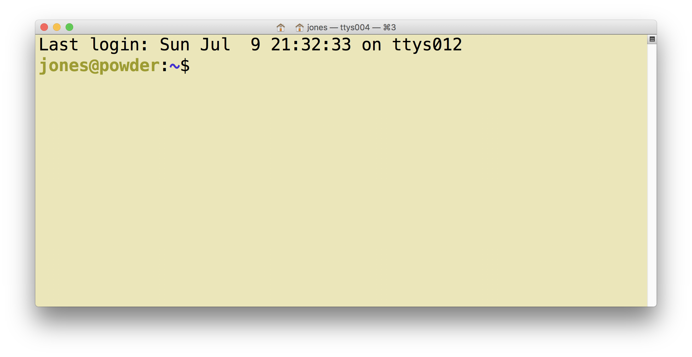

# Introduction
**Purpose:** 
Introduce participants to network and computing architectures to enable effective scientific computing.

**Background:**
Scientific synthesis fundamentally depends on the use of computers and the Internet. To complement the 
practical understanding of how networks of computers are structured, this lesson reviews basics
of computer networks and server-based computing in the service of scientific synthesis.  In particular,
the lesson reviews how computers are connected in networks, the relationship between 
networks, computer addresses, and web site domain names, and the utility of
remote computing and computing in the 'Cloud' for speeding up scientific analysis.

# Learning outcomes
1. To understand the basic architecture of computing networks
2. To conceptualize how computer hosts relate to web sites
3. To learn to connect to a remote computer via a shell
4. To appreciate the value of remote and cloud computing

# Background

## The Internet


## Our goal is to:

* Provide basic background on computer networking 
* Lay groundwork for understanding tools that use the Internet

## Basic networking

* Host computers connect via networking equipment
* Can send messages to each other over communication protocols
* Client: the host *initiating* the request
* Server: the host *responding* to a request


## Local networks


- All messages broadcast on the local network
    - Local hosts only "listen" for data that targets them

## Routed networks


* Mechanism to connect networks together via forwarding data along routing paths


## IP Numbers and Hostnames

* Hosts are assigned a **unique address** used for all communication and routing
    - Internet Protocol Address (IP Address)
        - 128.111.220.7
* Each IP Address can be used to communicate over various "ports"
    - Allows multiple applications to communicate with a host without mixing up traffic

* IP numbers can be difficult to remember, so also assign **hostnames**
    - Handled through the global Domain Name System (DNS)
    - Clients first look up a hostname in DNS to find the IP Number
    - aurora.nceas.ucsb.edu -> 128.111.220.46
    - Then they open a connection to the IP Number


## Client-Server and the Internet


## Peer to Peer networking


## Internet versus the Web

### What is the difference?

* Internet: Global communication network using the Internet Protocol (IP)
    - Supports many application protocols, including:
        - HTTP (web)
        - FTP (file transfer)
        - SMTP (email)
        - SSH (secure shell)

* Web: Global system of interlinked hypertext documents
    - Transported over HTTP application protocol (over IP)
    - Generally accessed using web browsers that retrieve the documents

## Routing on the internet

* 80 routers at the core
* dense "mantle" of routers at the periphery
    - loss of the core still leaves > 70% of internet connected peer-to-peer


## Internet Application Protocols

* Web (http)
* Email (smtp)
* Secure Shell (ssh)
* Telnet (telnet)
* File Transfer Protocol (ftp)
* Network News (nntp)
* ...

## The Web

* Global network of documents hosted on web servers around the world
* Web documents connected using hyperlinked HTML documents
* Other document types common (images, other media)


## Secure Shell

* Used for connecting to and running shell commands on a remote host
* Tremendously simplifies remote computing
* Supported out-of-the-box on Linux and Macs

# Exercise

## Launch your Terminal program

- MacOS: __Terminal__ Navigate to `Applications | Utilities` and open `Terminal`
- Windows: __Git Bash__ Navigate to `Windows Start | Git` and open `Git Bash`
    - Note: Alternate and possibly better terminal for Windows is [cmder](http://cmder.net/)




## Connecting to a remote server

```bash
jones@powder:~$ ssh jones@aurora.nceas.ucsb.edu
jones@aurora.nceas.ucsb.edu's password: 
jones@aurora:~$ 
```


## Change your password

```bash
jones@aurora:~$ passwd
Changing password for jones.
(current) UNIX password: 
Enter new UNIX password: 
Retype new UNIX password: 
```

- **Add your new password to your password manager!**
- Later you will need it to connect over the web to RStudio Server

# Modern cloud computing
In this session, we are introducing you to computing on a `cluster`, which is
just another name for a remote computer with a lot of processors. However,
computing is evolving rapidly, and there are many new technologies emerging to
help with scientific computing, and to speed it up. The maturing field of 
`cloud computing` is certainly useful to researchers conducting synthesis because
it allows them to access really large computing systems without having to purchase
the hardware.  Amazon, Google, and Microsoft are among the many companies trying
to capture the demand for computing infrastructure through cloud platforms. In each,
the cloud computing environment enables users to create a `virtual machine`, which
looks and acts like a standalong server, but in actuality is sharing an underlying
host computer with many other virtual machines.

Cloud computing is also evoloving mechanisms to make those virtualized platforms
easier to create and maintain with the advent of `container computing` systems.
Systems like `Docker` for building virtual containers are beyond our scope, but 
further reading is available online:

__Preethi Kasireddy__. [**A Beginner-Friendly Introduction to Containers, VMs 
    and Docker**](https://medium.freecodecamp.org/a-beginner-friendly-introduction-to-containers-vms-and-docker-79a9e3e119b).
