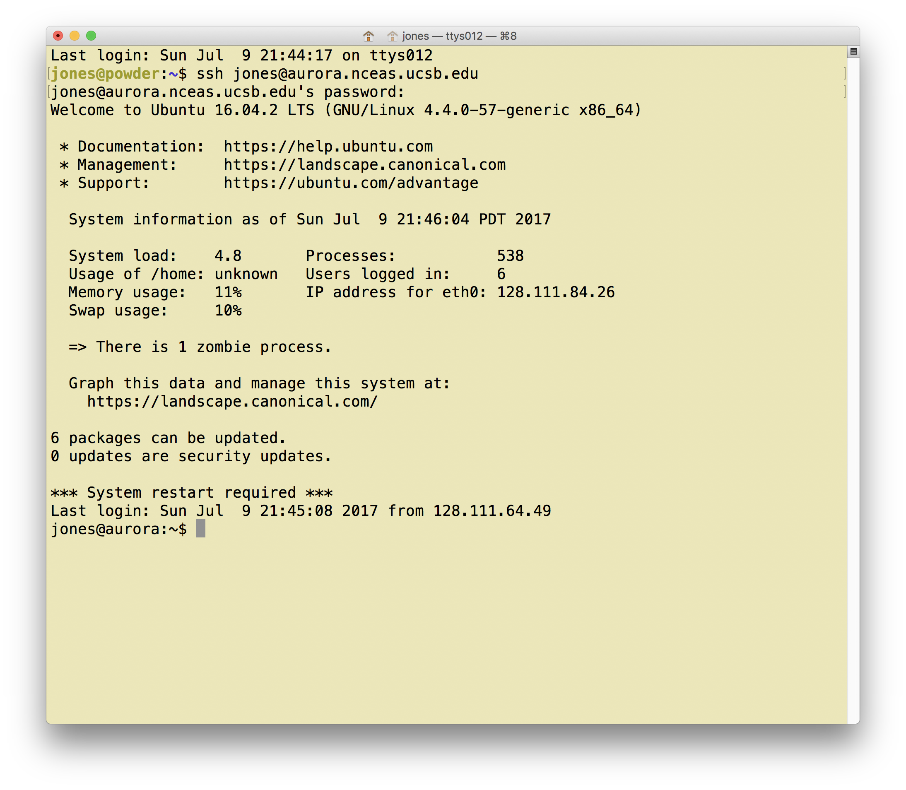
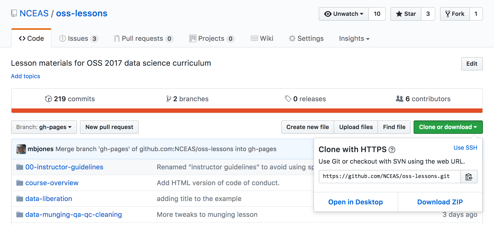

# Introduction

**Purpose:** 
Introduce participants to the unix command line to increase efficiency and reproducibility.

**Background:**
Scientific research, and especially scientific synthesis, requires extensive computing, which typically
involves creation of hudreds or thousands of data files, analytical processes, and
many products such as graphs, model outputs, maps, images, and more.  Managing this
complexity is often really hard, and researchers can easily lose track of just
what they did, when, and why.  Thus, traditional approaches to managing the research process
often fail the reproducibility test, as even the original investigators can't repeat their initial
process.


- From [PhDComics](http://phdcomics.com/comics/archive.php?comicid=1323)

Thus, the __command line__.  The command-line provides two major advantages to the researcher:

- Repeatability
    - Once you do it once, you can just re-run it
- Efficiency
    - What you can do to one file, you can do to millions

These advantages come at the cost of:

- A steep learning curve (with copious esoteric terminology)


# Learning outcomes
1. To understand the advantages of the command line over graphical interfaces
2. To understand the basic philosophy of Unix
3. To learn core Unix commands for navigation and file management


# The Command Line


Command line interpreters come in many flavors.  We will focus on Unix shell syntax, 
but even with Unix there is tremendous diversity.  Learning all of the nuances of one shell
can take years, but you will also find many variants on the servers you encounter.

## Draw Bridge


In this lesson, you will learn the power of the command line. But, you will 
undoubtedly also internalize that computers are exceedingly literal.  You type, they do. 
Or, more commonly, you type, they give an error.  My experience has been that I am 
far more productive when my attitude towards the computer is:

- Patient
- Persistent
- Systematic
- Incremental


## The operating system


## All about the X


* OS X
 :  [is a Unix](http://unix.stackexchange.com/questions/1489/is-mac-os-x-unix)!
* Linux
 :  is _not_ fully compliant, but certainly can be
      regarded as [functionally Unix](http://en.wikipedia.org/wiki/Unix-like)

## Some Unix hallmarks


* Multi-user, multi-process
* Separation of engine from interface
* Small tools for specific jobs
* Culture of text files and streams

## The Command Line


- GUI: Graphical user interface
- CLI: Command-line interface
 
## GUIs can be impressive


#### [Pay no attention to that man behind the curtain](http://www.youtube.com/watch?v=YWyCCJ6B2WE)

# CLIs let you get things done


## Why the CLI is worth learning

* Typically much more extensive access to features, commands, options
* Command statements can be written down, saved (scripts!)
* Easier automation
* Much "cheaper" to do work on a remote system (no need to
      transmit all the graphical stuff over the network)

## Let's connect

```bash
jones@powder:~$ ssh jones@aurora.nceas.ucsb.edu
```

which should give you a terminal window showing `aurora` as the host name:


## Files and directories

In the following code examples, you need to type the command, but not include 
the command prompt (e.g., `jones@aurora:~$`) which just shows that the computer 
is ready to accept a command.

We'll start by:

- creating two directories with `mkdir` (make directory)
- create a simple text file using `echo`
- Show the contents of that file using `cat` (concatenate)

```bash
jones@aurora:~$ mkdir oss
jones@aurora:~$ mkdir oss/data
jones@aurora:~$ echo "# Tutorial files related to OSS" > oss/README.md
jones@aurora:~$ cat oss/README.md
# Tutorial files related to OSS
jones@aurora:~$ 
```

Next, let's copy another file and look around in the directories:

- copy a file into your directory with `cp` (copy)
- change our working directory to that newly created directory using `cd` (change directory)
- list the files in the directory with `ls` (list)
- look where we are in the filesystem using `pwd` (print working directory)
- get an overview of the directory contents using `tree`


```bash
jones@aurora:~$ cp /tmp/plotobs.csv oss/data
jones@aurora:~$ cd oss
jones@aurora:~/oss$ ls
data  README.md
jones@aurora:~/oss$ pwd
/home/jones/oss
jones@aurora:~/oss$ tree
.
├── data
│   └── plotobs.csv
└── README.md

1 directory, 2 files
jones@aurora:~/oss$
```

Now, let's create another directory with two files so that we can demonstrate
removing files and directories.

- create another two directories named `sites` and `lakes` using `mkdir`
- create 3 files in each directory using `echo`
- examine our file structure using `tree`
- move or rename a file using `mv` (move)
- change our working directory to the `sites` directory using `cd` and check it with `pwd`
- remove two of the files using `rm` (remove) and list files with `ls`
- change directory back to the parent and check it with `pwd`
- remove the `sites` directory using `rmdir`, which will produce and error because the directory contains files
    - `rmdir` can only remove empty directories
- try again, using a command-line switch `rm -r sites` to recursively remove the directory and its files

```bash
jones@aurora:~/oss$ mkdir sites lakes
jones@aurora:~/oss$ echo "Site 1 Info" > sites/site1.txt
jones@aurora:~/oss$ echo "Site 2 Info" > sites/site2.txt
jones@aurora:~/oss$ echo "Site 3 Info" > sites/site3.txt
jones@aurora:~/oss$ echo "Lake Mary" > lakes/LakeMary.md
jones@aurora:~/oss$ echo "Lake Hunter" > lakes/HunterLake.md
jones@aurora:~/oss$ tree .
.
├── data
│   └── plotobs.csv
├── lakes
│   ├── HunterLake.md
│   └── LakeMary.md
├── README.md
└── sites
    ├── site1.txt
    ├── site2.txt
    └── site3.txt

3 directories, 7 files
jones@aurora:~/oss$ mv lakes/HunterLake.md lakes/LakeHunter.md
jones@aurora:~/oss$ ls lakes
LakeHunter.md  LakeMary.md
jones@aurora:~/oss$ cd sites
jones@aurora:~/oss/sites$ pwd
/home/jones/oss/sites
jones@aurora:~/oss/sites$ rm site2.txt site3.txt
jones@aurora:~/oss/sites$ ls
site1.txt
jones@aurora:~/oss/sites$ cd ..
jones@aurora:~/oss$ pwd
/home/jones/oss
jones@aurora:~/oss$ rmdir sites
rmdir: failed to remove 'sites': Directory not empty
jones@aurora:~/oss$ rm -r sites
jones@aurora:~/oss$ ls
data  lakes  README.md
jones@aurora:~/oss$
```

Note the use of the single dot `.` and the double dot `..` symbols in these
commands.  A single dot `.` represents the current directory, and a double dot `..`
represents the parent directory.  One can also use the tilde symbol `~` to represent
the your home directory, which is main directory where your files will reside.

## Let's look at our text file

- `cat` print file(s)
- `head` print first few lines of file(s)
- `tail` print last few lines of file(s)
- `grep` search for matching lines of file(s)
- `less` "pager" -- view file interactively

```bash
jones@aurora:~/oss$ head data/plotobs.csv 
obsid,siteid,plot,date_sampled,sciname ,diameter,condition
1,1,A,6/13/11,Abies lasiocarpa,31.84,normal
2,1,A,6/13/11,Picea engelmannii,3.21,dry
3,1,A,6/13/11,Picea engelmannii,7.2,dry
4,1,A,6/13/11,Picea engelmannii,11.62,dry
5,1,A,6/13/11,Picea engelmannii,11.25,dry
6,1,A,6/13/11,Picea engelmannii,13.16,normal
7,1,A,6/13/11,Picea engelmannii,18.6,normal
8,1,A,6/13/11,Picea engelmannii,23.62,dry
9,1,A,6/13/11,Picea engelmannii,31.75,normal
jones@aurora:~/oss$ tail data/plotobs.csv 
3287,32,B,6/10/12,Pseudotsuga menziesii,4.38,normal
3288,32,B,6/10/12,Pseudotsuga menziesii,3.09,dry
3289,32,B,6/10/12,Jamesia americana,7.98,dry
3290,32,B,6/10/12,Abies lasiocarpa,10.85,normal
3291,32,B,6/10/12,Abies lasiocarpa,13.55,dry
3292,32,B,6/10/12,Abies lasiocarpa,17.26,normal
3293,32,B,6/10/12,Abies lasiocarpa,21.65,dry
3294,32,B,6/10/12,Abies lasiocarpa,17.8,dry
3295,32,B,6/10/12,Abies lasiocarpa,23.4,normal
3296,32,B,6/10/12,Abies lasiocarpa,25.79,normal
jones@aurora:~/oss$ grep Sambucus data/plotobs.csv
13,1,A,6/13/11,Sambucus racemosa,3.83,dry
44,1,A,6/10/12,Sambucus racemosa,17.04,dry
75,1,B,6/13/11,Sambucus racemosa,3.39,dry
91,1,B,6/10/12,Sambucus racemosa,19.53,dry
116,2,A,6/13/11,Sambucus racemosa,1.4,dry
147,2,A,6/10/12,Sambucus racemosa,20.19,dry
...
jones@aurora:~/oss$
```

## Permissions

Working on syntheis projects means collaborating, which is really easy on unix
because multiple people can use the same computer at the same time. Right now,
we are all using `aurora` at the same time, running commands in our own part of
the file storage system.  But what if we want to share files?  Unix lets each
person control who can access their files through a set of permissions which can 
be seen by doing a long listing with `ls -l`:

```bash
jones@aurora:~/oss$ ls -l README.md 
-rw-rw-r-- 1 jones staff 32 Jul 10 01:10 README.md
jones@aurora:~/oss$ 
```

You can interpret the permissions as follows:


### All files have permissions and ownership

* Change permissions: `chmod`, using for example `chmod o+r README.md`
* Change ownership: `chown`

To see someone else's files, they have to permit you to have the proper permissions.
For example, you can examine the contents of one of my data files using the full
path to the file, as long as you have the needed file permissions:

```bash
jones@aurora:~/oss$ cat ~jones/oss/lakes/LakeMary.md 
Lake Mary
jones@aurora:~/oss$
```

## Getting help

  

* `<command> -h`, `<command> --help`
* `man`, `info`, `apropos`, `whereis`
* Search the web!

## General command syntax

* `$ command [options] [arguments]`

### where `command` must be an _executable_ file on your `PATH`
* `echo $PATH`

### and `options` can usually take two forms
* short form: `-h`
* long form: `--help`

## Cheatsheets for remembering it all

**Linux/Unix Cheetsheet**: http://cheatsheetworld.com/programming/unix-linux-cheat-sheet/

## Clone the lessons git repository to aurora

To make it easier to follow the remaining commands, lets use git to make a copy of the lessons repository.

Go find the git URL of the repository we want to clone.  First, go to the GitHub 
repository page and copy the reposiotry clone URL:

https://github.com/NCEAS/oss-lessons


Now, open a terminal on aurora, login, and clone the repository:

```bash
jones@powder:~$ ssh aurora.nceas.ucsb.edu
jones@aurora:~$ cd oss
jones@aurora:~/oss$ ls
data  lakes  README.md
jones@aurora:~/oss$ git clone https://github.com/NCEAS/oss-lessons.git
Cloning into 'oss-lessons'...
remote: Counting objects: 1554, done.
remote: Compressing objects: 100% (796/796), done.
remote: Total 1554 (delta 673), reused 1548 (delta 667), pack-reused 0
Receiving objects: 100% (1554/1554), 90.17 MiB | 21.84 MiB/s, done.
Resolving deltas: 100% (673/673), done.
Checking connectivity... done.
jones@aurora:~/oss$ ls
data  lakes  oss-lessons  README.md
jones@aurora:~/oss$ cd oss-lessons/servers-networks-command-line
jones@aurora:~/oss/oss-lessons/servers-networks-command-line$ ls
1-servers-net.html        3-bash-loops.Rmd   paleo-mammals-v2.txt
1-servers-net.Rmd         4-regex.Rmd        paleo-mammals-v3.txt
2-commandline-intro.html  images             plotobs.csv
2-commandline-intro.Rmd   paleo-mammals.txt
jones@aurora:~/oss/oss-lessons/servers-networks-command-line$
```


## Text editing

### Some editors

There are many text editors available for Unix systems. `nano` is one that is
simple and fairly easy to learn, so we'll use that when needed, but most people
prefer `vim` or `emacs` which are much more powerful but also harder to learn.
If you use the commandline, I recommend learning one of them thoroughly.

- `vim`
- `emacs`
- `nano`

```bash
$ nano paleo-mammals.txt
```


## A sampling of useful commands

* `wc` count lines, words, and/or characters
* `diff` compare two files for differences
* `sort` sort lines in a file
* `uniq` report or filter out repeated lines in a file

## Get into the flow, with pipes 


```bash
$ ls -1 ../../lakes | wc -l
2
$ ls -1 ../../lakes | wc -l > lakecount.txt
$ cat lakecount.txt 
2
```

```bash
$ diff -u paleo-mammals.txt paleo-mammals-v2.txt
--- paleo-mammals.txt	2017-07-12 06:13:24.979291128 -0700
+++ paleo-mammals-v2.txt	2017-07-12 06:13:24.979291128 -0700
@@ -4,7 +4,7 @@
 Homotherium serum,American Scimitar Cat,1m,1.5M,10K
 Castoroides ohioensis,Giant Beaver,1m,1.5M,10K
 Dasypus bellus,Beautiful Armadillo,1m,1M,10K
-Osteoborus cynoides,Bone-Crushing Dog,.9m,8M,1.5M
+Osteoborus cynoides,Bone-Crushing Dog,9m,8M,1.5M
 Camelops hesternus,American Camel,3.6m,1M,10K
 Aepycamelus,Giraffe Camel,3m,10M,5M
 Megalocerous giganteus,Giant Irish Elk,2.1m,500k,10K
@@ -16,7 +16,7 @@
 Doedicurus,Glyptodon,1.5m,1.5M,12K 
 Uintatherium robustum,,1.5m,50M,35M
 Odobenocetops peruvianus,Walrus-Whale,2.1m,5M,1M
-Mammuthus primigenius,Woolly mammoth,2.75m,1.5M,8K 
+Mammuthus primigenios,Woolly mammoth,2.75m,1.5M,8K 
 Coelodonta antiquitatis,Woolly rhinoceros,2m,500K,10K
 Megatherium americanum,Ground sloth,6m,30M,8K 
 Megalonyx jeffersonii,Jefferson's Ground Sloth,3m,30M,8K 
$ diff -u <(sort paleo-mammals.txt) <(sort paleo-mammals-v2.txt)
--- /dev/fd/63	2017-07-12 06:27:26.274193251 -0700
+++ /dev/fd/62	2017-07-12 06:27:26.270193219 -0700
@@ -12,12 +12,12 @@
 Gomphotheres,Four-Tusked Elephant,2.4m,15M,5M
 Homotherium serum,American Scimitar Cat,1m,1.5M,10K
 Indricotherium transsouralicum,,4.7m,30M,25M
-Mammuthus primigenius,Woolly mammoth,2.75m,1.5M,8K 
+Mammuthus primigenios,Woolly mammoth,2.75m,1.5M,8K 
 Megalocerous giganteus,Giant Irish Elk,2.1m,500k,10K
 Megalonyx jeffersonii,Jefferson's Ground Sloth,3m,30M,8K 
 Megatherium americanum,Ground sloth,6m,30M,8K 
 Nothrotheriops shastensis,Shasta Ground Sloth,1.5m,30M,8K 
 Odobenocetops peruvianus,Walrus-Whale,2.1m,5M,1M
-Osteoborus cynoides,Bone-Crushing Dog,.9m,8M,1.5M
+Osteoborus cynoides,Bone-Crushing Dog,9m,8M,1.5M
 Smilodon fatalis,Sabertooth Cat,1.2m,1.5M,10K
 Uintatherium robustum,,1.5m,50M,35M
```

```bash
$ ls nofilehere.txt
ls: cannot access 'nofilehere.txt': No such file or directory
$ ls nofilehere.txt 2>/dev/null
$
```

## A sampling of more advanced utilities

* `grep` search files for text
* `sed` filter and transform text
* `find` advanced search for files/directories
* `cut` extract parts of files like columns
* `join` merge files using a common shared column

## grep


## grep

### Show all lines containing "bug" in my R scripts

```bash
$ grep bug *.Rmd
2-commandline-intro.Rmd:### Show all lines containing "bug" in my R scripts
2-commandline-intro.Rmd:$ grep bug *.R
2-commandline-intro.Rmd:$ grep -c bug *.R
2-commandline-intro.Rmd:### Print the names of files that contain bug
2-commandline-intro.Rmd:$ grep -l bug *.R
2-commandline-intro.Rmd:### Print the lines of files that __don't__ contain bug
2-commandline-intro.Rmd:$ grep -v bug *.R
2-commandline-intro.Rmd:### Remove all lines containing "bug"!
2-commandline-intro.Rmd:$ sed '/bug/d' myscript.R
2-commandline-intro.Rmd:### Call them buglets, not bugs!
2-commandline-intro.Rmd:$ sed 's/bug/buglet/g' myscript.R
2-commandline-intro.Rmd:$ sed '/#/ s/bug/buglet/g' myscript.R
```

### Now count the number of occurrences per file

```bash
$ grep -c bug *.Rmd
1-servers-net.Rmd:0
2-commandline-intro.Rmd:12
3-bash-loops.Rmd:0
4-regex.Rmd:0
```

### Print the names of files that contain bug

```bash
$ grep -l bug *.Rmd
2-commandline-intro.Rmd
```

### Print the count lines of files that __don't__ contain bug

```bash
$ grep -v bug *.Rmd |wc -l
841
```

## sed


## sed

### Remove all lines containing "bug"!

```bash
$ sed '/bug/d' 2-commandline-intro.Rmd
```

### Call them buglets, not bugs!

```bash
$ sed 's/bug/buglet/g' 2-commandline-intro.Rmd
```

### Actually, only do this on lines containing a #

```bash
$ sed '/#/ s/bug/buglet/g' 2-commandline-intro.Rmd
```


## find


### Like Rover, the Windows search dog. But more useful.

## find

### Show me my Rmd files!

```bash
$ find . -iname '*.Rmd'
```

### Which files are larger than 10GB?

```bash
$ find . -size +5K -ls
```

## cut

Cut is used to extract columns from a delimited text file, like a CSV file. It is fast and simple.

```bash
$ cut -d , -f 1,5 plotobs.csv 
obsid,sciname 
1,Abies lasiocarpa
2,Picea engelmannii
3,Picea engelmannii
4,Picea engelmannii
5,Picea engelmannii
...
```

```bash
$ cut -d , -f 1,5 plotobs.csv > plot-spp.csv 
$ cut -d , -f 1,6 plotobs.csv > plot-diam.csv
$ head plot-spp.csv plot-diam.csv 
==> plot-spp.csv <==
obsid,sciname 
1,Abies lasiocarpa
2,Picea engelmannii
3,Picea engelmannii
4,Picea engelmannii
5,Picea engelmannii
6,Picea engelmannii
7,Picea engelmannii
8,Picea engelmannii
9,Picea engelmannii

==> plot-diam.csv <==
obsid,diameter
1,31.84
2,3.21
3,7.2
4,11.62
5,11.25
6,13.16
7,18.6
8,23.62
9,31.75
```

## join

```bash
$ join -j 1 -t , <(sort plot-diam.csv) <(sort plot-spp.csv)
```

## Online resources

* http://www.ibm.com/developerworks/linux/library/l-lpic1-v3-103-1/
* http://linuxcommand.org/lc3_learning_the_shell.php
* [Free book!](http://linuxcommand.org/tlcl.php)


