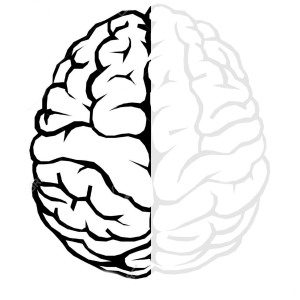
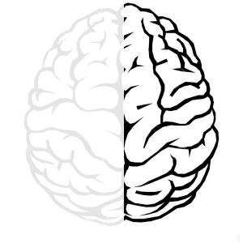
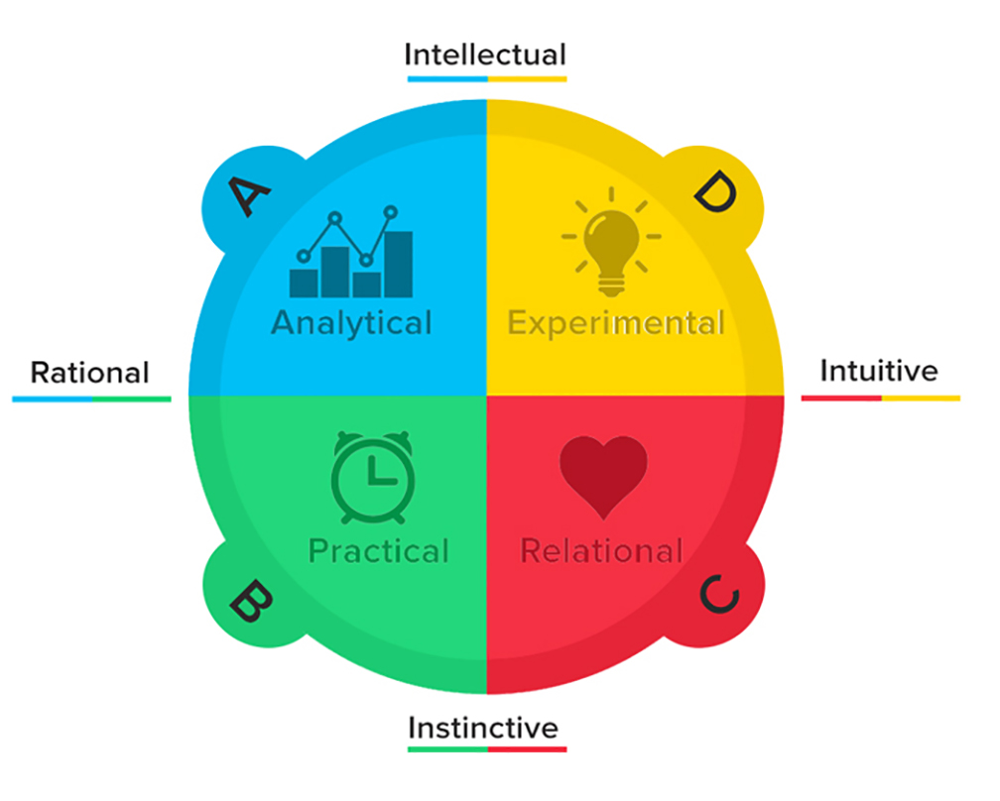
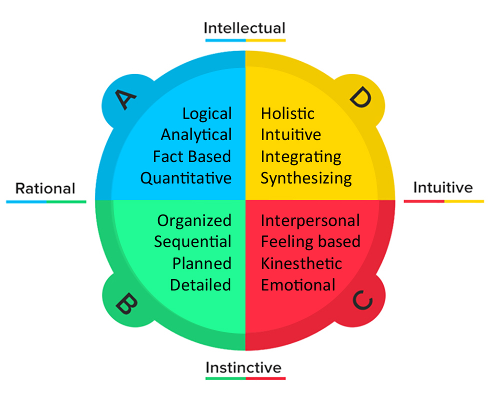

Thinking Preferences
========================================================
width: 1440
height: 900
font-family: 'Gill Sans', 'Source Sans Pro', 'Aller', 'Helvetica'
css: ../course-overview/oss.css

### A tool for understanding group dynamics

The brain
========================================================

  

***

  

Left brain
========================================================

  

***

  
### Analytical / Systematic

Right brain
========================================================

  

***

  
### Artistic / Emotional

Neocortex 
========================================================

  

***

  
### Intellect

Limbic system
========================================================

  

***

  
### Emotion

The whole brain
========================================================

  

Analytical

Artistic

Intellect

Emotion

***

  

Ned Herrmann: Whole Brain Model
========================================================

www.herrmannsolutions.com

Ned Herrmann: Whole Brain Model
========================================================

