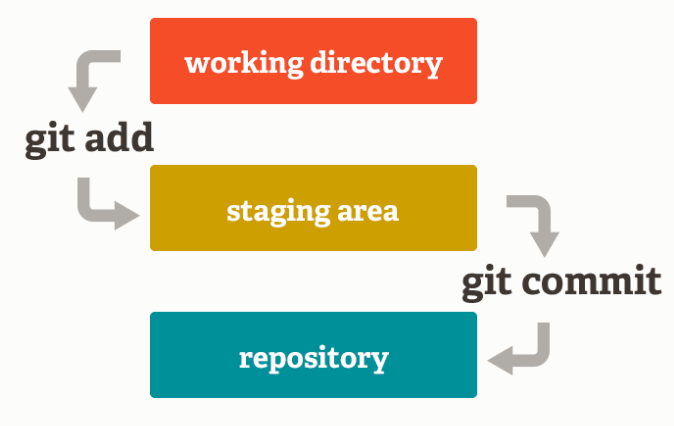
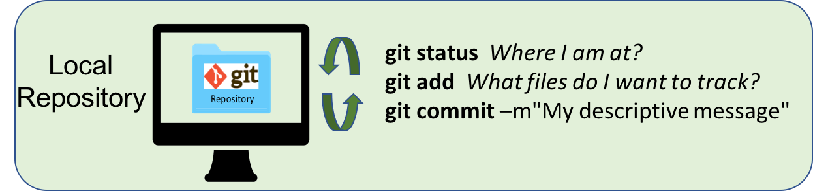

# Git 


## Why do I need that again?


Version control is very useful to **keep track of changes you made to your scripts**. It allows you to choose when you have reached a stage in your code that you think is worth keeping track of, like a new function that makes your data analysis soooooo much better. 

For scientists, version control is a useful tool to help you to track changes you make to your scripts and enable you to share your codes with your collaborators. For example, if you break your code, git can help you to revert to an earlier working version. Want one of your collaborators to add a feature to your code to do a specific analysis? Version control can help you to do so in a smooth and organized manner, tracking who changed what.

This training material focuses on the code verioning system calld `Git`. Note that there are others, such as `Mercurial` or `svn` for example.

## What is git?


Git is a *free* and *open source* distributed *version control system*. It has many functionalities and was originally geared towards software development and production environment. In fact, Git was initially designed and developed in 2005 by Linux kernel developers (including Linus Torvalds) to track the development of the Linux kernel. Here is a [fun video](https://www.youtube.com/watch?v=4XpnKHJAok8) of Linus Torvalds touting Git to Google. 

## How does it work?

Git can be enabled on a specific folder/directory on your file system to version files within that directory (including sub-directories). In git (and other version control systems) terms, this “tracked folder” is called a **repository** (which formally is a specific data structure storing versioning information).

### More details:
  
- Git stores snapshot of your files (that have changes) 
- Git is distributed, meaning that all the copies of your repository are of equal value, containing all your codes and its history. There is no central repository
- Git has integrity, meaning each file is checked (summed) to be sure there was no bit loss during any file manipulation by git. Each snapshot (also called commit) has a unique identifier.

## What git is not

- Git is not a backup per se
- Git is not GitHub (or more exactly: GitHub is not Git)
- Git is not good at versioning large data (there are work around that)


# The Git workflow

## Overview


1. You modify files in your working directory and save them as usual

2. You **add** snapshots of your changes files to your staging area

3. You do a **commit**, which takes the files as they are in the staging area and permanently stores them as snapshots to your Git directory.

**And repeat!!**

Every time you create a new snapshot, you add the new version of the file to the database, while keeping all the previous versions in the database. It creates an history that is like a graph that you can navigate:


# Getting started with Git

## [TRY GIT in 15min!](https://try.github.io/levels/1/challenges/1)

Before you start using git on any computer, you will have to set your identity on your system, as every snapshot of files is associated with the user who implemented the modifications to the files.

## 1. Setting up your identity

You need to do this step the first time you use git on a computer.

**Setup your profile:**

Your name and email: 

```{bash}
git config --global user.name "yourName"
git config --global user.email "yourEmail"
```

**Optional:**

Check that everything is correct: 

```{bash}
git config --global --list
```

Modify everything at the same time:

```{bash}
git config --global --edit
```

Set your text editor: 

```{bash
git config --system core.editor vim
```

Cache your GitHub credentials (for 1 hour):

```{bash}
git config --global credential.helper 'cache --timeout=3600'
```

 Want to know more about the available configuration options? How to change the default [text editor](https://git-scm.com/book/en/v2/Getting-Started-First-Time-Git-Setup) used by git? How make git remember your [GitHub credentials](https://help.github.com/articles/caching-your-github-password-in-git/#platform-all)?

## 2. Starting a git repository

As we mentioned earlier, a **git repository** is a folder/directory on your machine in which content is monitored for any changes by git.

### A.) Start versioning an existing folder on your system

`git init` is the command to start the tracking in a specific directory and transform it into a git repository:

```{bash}
mkdir oss
cd oss
mkdir dessert
cd dessert
pwd
git init
```

### B.) Copying an existing repository to your system

`git clone` is the git command to copy an existing repository to your machine, more precisely adding the repository to the directory you are in.

```{bash}
cd 
mkdir oss
cd oss
git clone https://github.com/your_username/your_reponame.git
```
The cloning process will automatically create a directory on your machine named like the online repository.

## Tracking your changes

Let us have a closer look at the git workflow. It is important to stress that almost all of the git workflow happens on your local machine:



## Example

Navigate in the `dessert` repository you just created.

1.) Let us create a csv file containing our name and favorite dessert:

```{bash}
vim favorite_desserts.csv
```
2.) Edit the new file adding headers and your info:

Note: hit the key `i` to switch to *insert mode* in vim. My file would look like this

```
Name, Dessert
Julien, Ice cream
```

Exit the insert mode  `esc` 

Exit vim and save `:wq`

3.) Add the new file to git:

```{bash}
git status
git add favorite_desserts.csv
git status
git commit -m "Julien's favorite dessert"
git status
```
4.) Add a friend to the csv:

```{bash}
vim favorite_desserts.csv

My name, My desert
Julien, Ice cream
Eliott, Crepes
```
Save and exit vim by typing `:wq`

5.) Add (stage) and commit the new version of the file

```{bash}
git status
git add favorite_desserts.csv
git status
git commit -m "Adding Eliott's favorite dessert"
git status
```

6.) Check the differences between the two last commits:

```{bash}
git diff HEAD~1
```

Note: hit `q` to exit


7.) We can also look at the log of commits to look a the commit sequence

```{bash}
git log

git log -1
```


# Getting information about git

* `git status` this command is your friend! It will tell you where you are at and what are your options. You can use at any point in your process.
* `git log` displays history of committed snapshots. It lets you list the project history, filter it, and search for specific changes.
* `git diff --cached`
To be used before committing, to preview the changes to be committed. 
* `git diff HEAD~1 my_script.R` to inspect the changes between the last commit (HEAD) and the previous one
* `git diff HEAD~2 my_script.py` to inspect the changes between the last commit (HEAD) and 2 commits before.


Git has a lot of terms and commands, see reference at the end of this document for an extensive terminology.

# Ignoring certain types of file

`.gitignore` is a specific file used to list what (type of) files you do not want git to track. This file need to be placed at the top level of the directory.

File content example from GitHub:
<https://gist.github.com/octocat/9257657>

To create this file from the terminal/shell:

```{bash}
vim .gitignore
```

To know more: <https://git-scm.com/docs/gitignore>


# Undoing things

## Unstage a file

`git reset HEAD` lets you remove a file from the staging area

```{bash}
git reset HEAD <my_file_I_added_by_mistake.xls>
``` 
This will remove the file from your next commit. Can be used to undo an erroneous `git add`.

## Undo your last commit

`git commit --amend` let you amend your last commit with the most recent changes, like for example if you forgot a file

```{bash}
git add <missing_script.R>
git commit --amend -m "My new message"
```

More info about how to undo things [here](https://git-scm.com/book/en/v2/Git-Basics-Undoing-Things)

## Undo your changes

***Warning!*** `git checkout` overwrite the file version by the latest committed one => your changes will be lost!

```{bash}
git checkout -- test_file.txt
``` 

You can also revert a file to a former commit in the history using the unique commit hash

```{bash}
git checkout e11e34 test_file.txt
``` 


# Few other terms you might have heard

* **HEAD**: it is the reference that points by default to the latest commit
* **Branches**: A branch represents an independent line of development, parallel to the master. In fact, the default branch name that is created by ```git init``` is called ***master***.


# Next session

[**Remote repositories and collaboration with GitHub**](https://nceas.github.io/oss-lessons/version-control/2-git-remote-collaboration.html)


# References
- Interactive git 101: [https://try.github.io/](https://try.github.io/)
- Very good tutorial about git: [https://www.atlassian.com/git/tutorials/what-is-version-control](https://www.atlassian.com/git/tutorials/what-is-version-control)
- Git tutorial geared towards scientists: [http://nyuccl.org/pages/gittutorial/](http://nyuccl.org/pages/gittutorial/)
- Short intro to git basics: [https://github.com/mbjones/gitbasics](https://github.com/mbjones/gitbasics)
- Git documentation about the basics: [http://gitref.org/basic/](http://gitref.org/basic/)
- Git documentation - the basics: [https://git-scm.com/book/en/v2/Getting-Started-Git-Basics](https://git-scm.com/book/en/v2/Getting-Started-Git-Basics)
- Git terminology: [https://www.atlassian.com/git/glossary/terminology](https://www.atlassian.com/git/glossary/terminology)
- NCEAS wiki page on git: [https://help.nceas.ucsb.edu/git?s[]=git](https://help.nceas.ucsb.edu/git?s[]=git)
- In trouble, guide to know what to do: [http://justinhileman.info/article/git-pretty/git-pretty.png](http://justinhileman.info/article/git-pretty/git-pretty.png)
- Want to undo something? <https://github.com/blog/2019-how-to-undo-almost-anything-with-git> 

