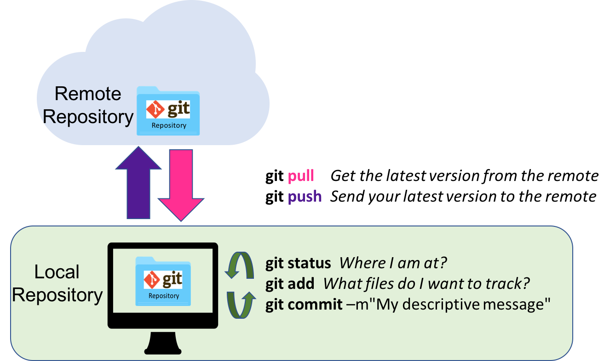
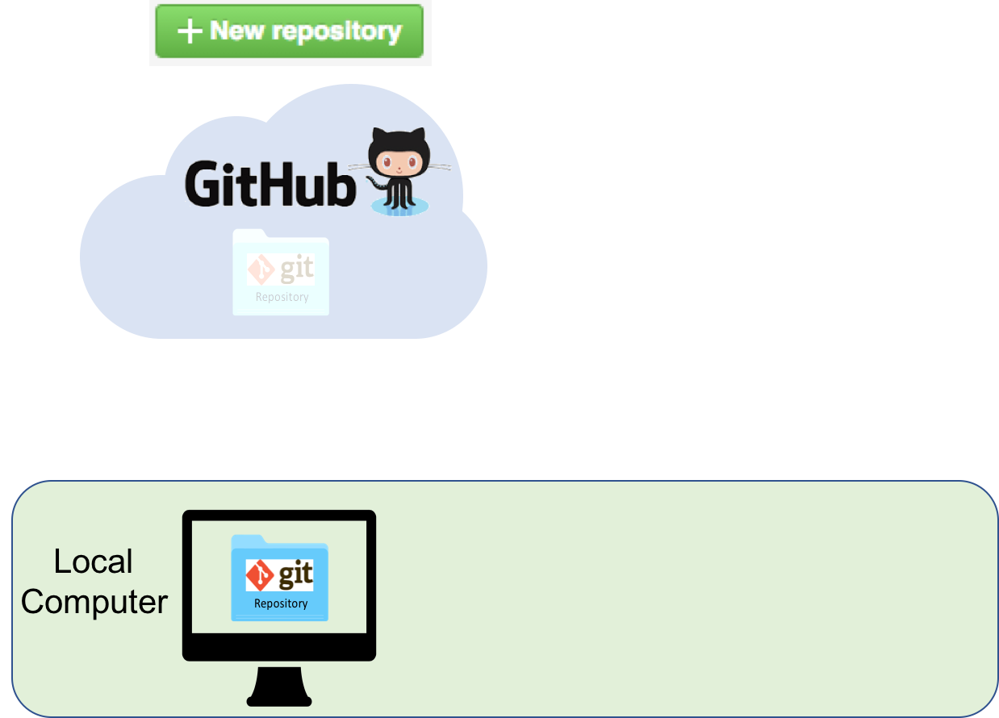
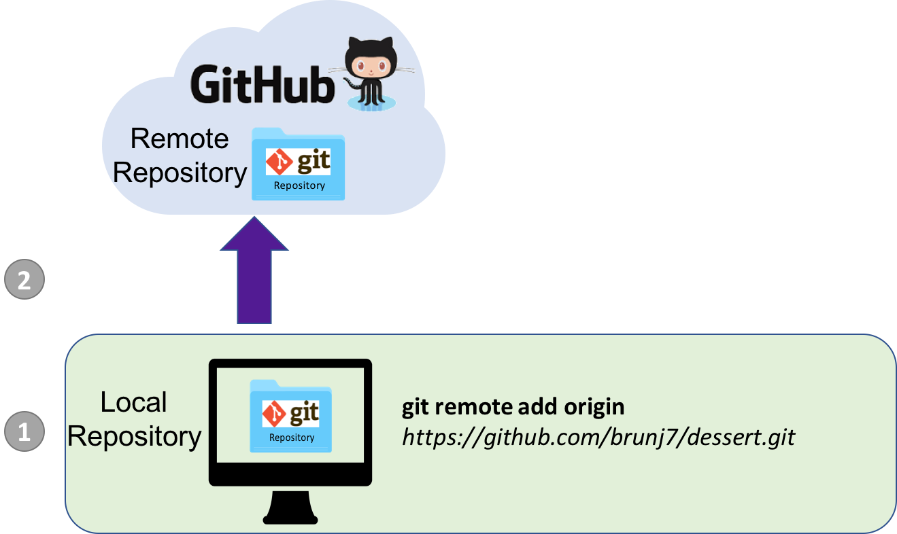
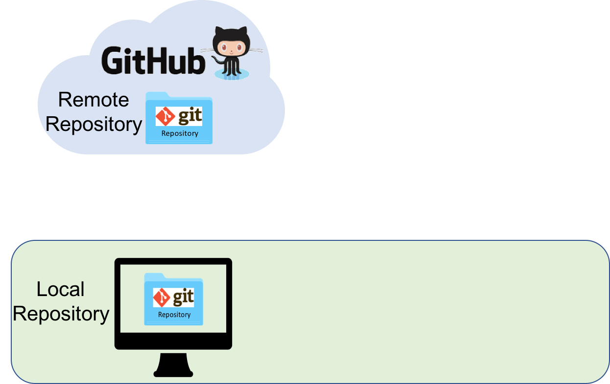
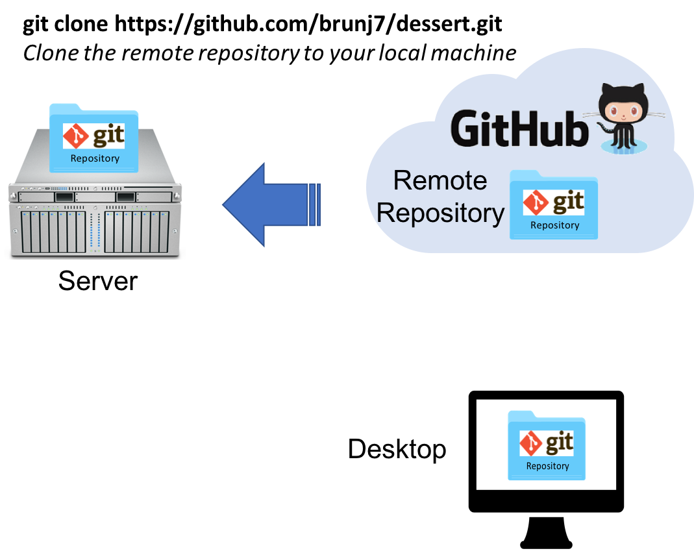
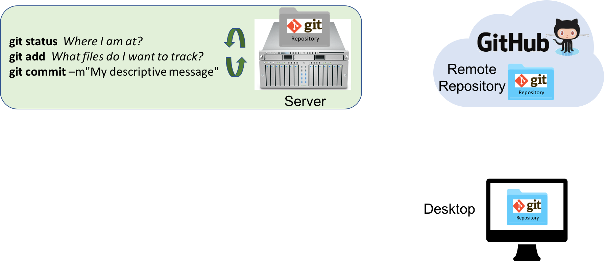
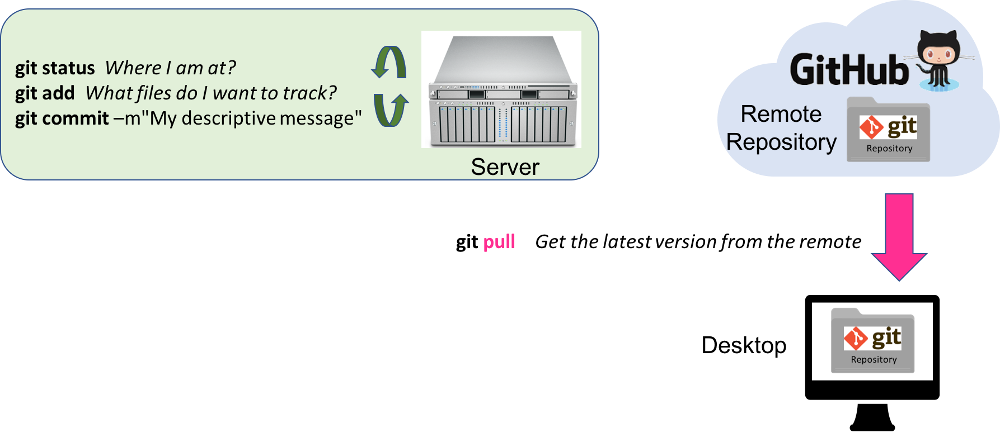
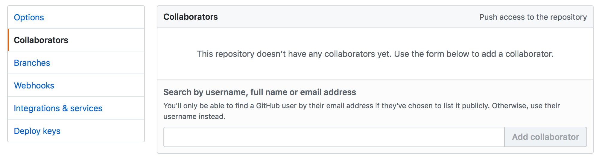
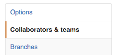
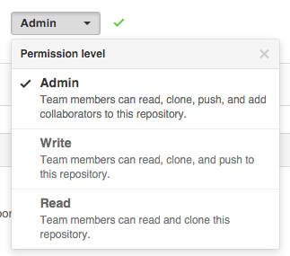

# Collaborating with git and GitHub

***So far we have used git locally, on one machine***. One strength of git and GitHub are great collaborative tools enabling you to share and co-edit codes and files with other researchers. Git and GitHub can also help you to move files between machines (your work desktop, your laptop, servers, ...) and keep the files synchronized across these machines.

## Adding remotes to your workflow

It is important to highlight that a good portion of the workflow happens on your local machine (in green) and a part requires interactions with a remote machine (in blue):

### Sequence order: 

1.) `git add`  Select the files you would like to take a snapshot of

2.) `git commit -m "my descriptive message"`  Take the snapshot adding a descriptive note

-------------------------------------------  REMOTE  -------------------------------------------

3.) `git pull` : be sure you have the latest version of the picture album from the server

4.) `git push` : send your latest version of the picture album to the server





**=> To allow to exchange files with a remote repository, we will first to tell git where this remote repository is located on the Web**


## GitHub
	
You might also have heard of [GitHub](https://github.com). **GitHub is a company that hosts git repositories online** and provides several collaboration features (among which `forking`). GitHub fosters a great user community and has built a nice web interface to git, also adding great visualization/rendering capacities of your data.

* **GitHub.com**: <https://github.com>
* **A user account**: <https://github.com/brunj7>
* **An organization account**: <https://github.com/nceas>
* **NCEAS GitHub instance**: <https://github.nceas.ucsb.edu/> 

### Creating a new repository

We are going to create a new repository on your GitHub account:

* Click on 
* Enter a descriptive name for your new repository (avoid upper case and use `-` instead of spaces)
* Choose **"Public"** (Private repositories are not free)
* Check **"Initialize this repository with a README”**
* Add a `.gitignore` file (optional). As the name suggest, the gitignore file is used to specify the file format that git should to track. GitHub offers pre-written gitignore files for commodity
* Add a license file (optional) 

 **=> Here it is, you now have a repository in the cloud!!** 


 Here is a website to look for more pre-written`.gitignore` files: <https://github.com/github/gitignore>


## Pushing your local repository to a remote server

This is the case where you already worked in a local repository and you would like to add your local repository to a remote computer or server

First, we will need to create a **bare** remote repository. In this example we wile create a bare repository on GitHub. It is the exact same steps we have seen previously, except we **will not check**`initialize this repository with a README file`. 

Keeping on our `dessert` example, go to your GitHub account and create a new **bare** repository called `dessert`





Then, within your local repository on your computer, you will need to tell git where on the web is located the bare repository ready to receive the entire content of your local repository:

1. Add the remote address: 

```bash
git remote add origin https://github.nceas.ucsb.edu/<my_github_username>/dessert.git
```

2. Do your initial push to the master branch, setting up the upstream tracking. From inside your local dessert repository: 

```bash
git push -u origin master
```

3. Enter your GitHub credentials when asked




The `-u` flag sets the upstream tracking. This allows git to track changes on the remote branch. It also allows you to `pull` without argument (or `merge` to be exact). You only need to set it once (per branch). Note that when you `clone` a repository, the upstream tracking is set automatically to `origin/master`, therefore you can directly use `git push` on the master branch without additional arguments. 


## Cloning a remote repository to your local machine

This is the opposite situation: You would like to bring an exact copy (clone) of a remote repository to your local machine.

In this example we are going to clone to your local machine the repository containing all the teaching material for the OSS:

At the command line, you meed to navigate to the location where you would like to create your new repository. Remember a repository is a directory/folder a the file system level. Note that the cloning process is going to create the directory/folder of the repository, so you should navigate to the folder where you would like the repository to be a sub-folder. Assuming you are in your `dessert` repository and that you want to clone the `oss-lessons` remote repository next to it:

```bash
cd ..
git clone https://github.com/NCEAS/oss-lessons.git
```

This is it! Note that no login was required since anybody can clone a public repository from GitHub.


## Moving codes and files from one computer to a server or another remote machine

We will use the `dessert` repository created in the previous section to illustrate how these tools can be used to move your work to another machine and help you to keep versions up-to-date between these machines.

You should be now in the following situation with our dessert example: your local repository should be pushed to github, with the two content being identical:

 

### Clone the repository to a second machine

First we should bring our repository to the new machine. Since it is not currently on this machine, we will have to clone the repository from GitHub to this computer. In our case, this second machine will be NCEAS analytical server Aurora:

1. Connect to Aurora via the command line using `ssh`

```bash
ssh <username>@aurora.nceas.ucsb.edu
```

2. Clone the repository to your home directory:

```bash
git clone https://github.nceas.ucsb.edu/<my_github_username>/dessert.git
```



=> _Now, we have three **exact** copies of our repository on a server, in the cloud and on a desktop._

### Keeping things synchronized

Now, let say we are working on the server to scale up our analysis or in our dessert example write a R script to read the csv about the favorite desserts.

##### Let us add a new person to our csv

1. Go inside the dessert directory

```bash
cd dessert
```

2. Edit the file

```bash
vim favorite_desserts.csv

My name, My desert
Julien, Ice cream
Eliott, Crepes
Sophia, Chocolate ice cream
```

Save and exit vim by typing `:wq`

3. Stage and commit our changes the same way we have done before

```bash
git status
git add favorite_desserts.csv
git commit -m"adding Sophia"
```

OK, where are we at?



As you can see, now the git commit history is different on the server than on GitHub and on your computer. You can verify by going to your github account and looking at `favorite_desserts.csv`. These are only two name listed. To implement the latest changes to the dessert repository on GitHub we will have to use `git pull and pull`.

##### pushing the latest changes

When you want to push your change to a repository, it is always good to first pull the latest version of the remote repository to your local repository (the repository on the server in this case) to be sure you have all the changes that might have been created on the online repository

```bash
git pull
git push
```

Enter your GitHub credentials when asked.

Now if you use your web browser to go to your repository on GitHub and click on the `favorite_desserts.csv`. It should have 3 rows.


##### getting the latest changes

Now we want to pull the latest version to our Desktop.

```bash
git pull
```

This is it!, we are back to the situation were we have 3 exacts copies of our dessert repository. 



Note that you do not need to synchronize your repositories across your machines/locations at every commit. You can work and commit on one machine numerous times before synchronizing with GitHub or another machine.


##   Challenge

Write a R code to read the favorite_desserts.csv files in and add a new row to the data frame and overwrite the csv with the new entry. Of course you need to track the development of your code using git!!


## Collaborating with others

### Collaborating through Forking, aka the GitHub workflow

A **fork** is a **copy of a repository** that will be stored under your user account. Forking a repository allows you to freely experiment with changes without affecting the original project.

Most commonly, forks are used to either propose changes to someone else's project or to use someone else's project as a starting point for your own idea.

When you are satisfied with your work, you can initiate a ***Pull Request*** to initiate discussion about your modifications. Your commit history allows the original repository administrators to see exactly what changes would be merged if they accept your request.  

By using GitHub's `@mention` syntax in your Pull Request message, you can ask for feedback from specific people or teams.

### Collaborating through write access

When you collaborate closely and actively with colleagues, you do not want necessarily to have to review all their changes through pull requests. You can then give them write access (`git push`) to your repository to allow them to directly edit and contribute to its content.

#### Adding collaborators to a repository 

* Click on the repository
* On the right panel, click 
* On the left pane, click Collaborators and enter the usernames you want to add 

#### Adding a team to a repository (organization only)

* Click on the repository
* On the right panel, click 
* On the left pane, click Collaborators & teams 
* Select your team 
* Select the appropriate Permission level. We recommend Write or Admin. Admin allows people to also add collaborators. 



# Next session

[**git advanced: branches and merge conflicts**](https://nceas.github.io/oss-lessons/version-control/3-git-advanced.html)

# References

- GitHub:
 - guides on how to use GitHub: [https://guides.github.com/](https://guides.github.com/)
 - GitHub from RStudio: [http://r-pkgs.had.co.nz/git.html#git-pull](http://r-pkgs.had.co.nz/git.html#git-pull)
- Forking:
 - [https://help.github.com/articles/fork-a-repo/](https://help.github.com/articles/fork-a-repo/)
 - [https://guides.github.com/activities/forking/](https://guides.github.com/activities/forking/)