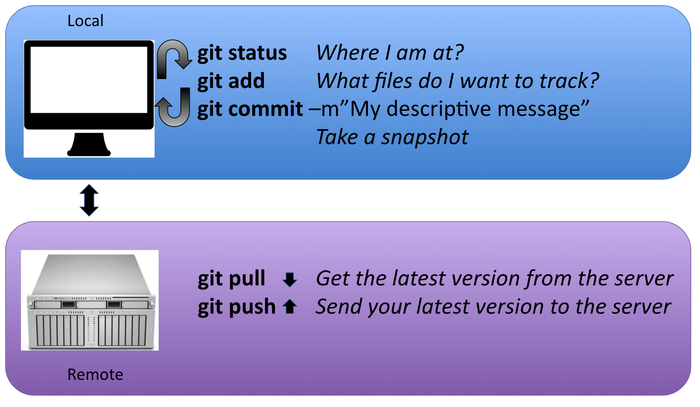
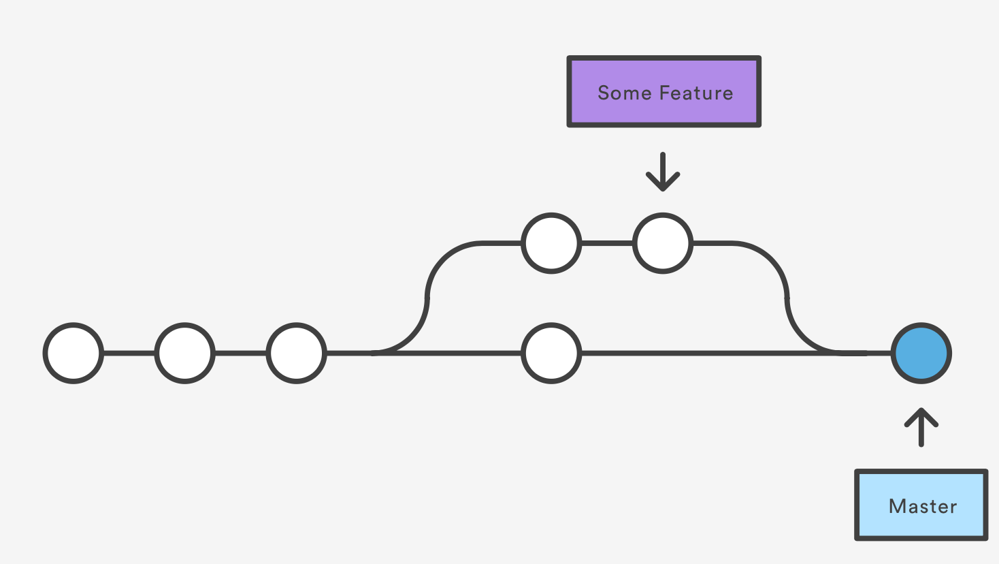

Code versioning - Working with remotes
===============================

***So far we have used git locally, on one machine***. One strength of Git is that it allows you to share and co-edit codes and files.

## Adding remotes to your workflow

It is important that a good portion of the worflow happens on your local machine (in blue) and a part requires interactions with a remote machine (in purple):



### Sequence order: 

1.) ```git add```(adding the guys you want on the picture)

2.) ```git commit -m "my descriptive message"``` (taking the picture)

-------------------------------------------  REMOTE  -------------------------------------------

3.) ```git pull``` : be sure you have the latest version of the picture album from the server

4.) ```git push``` : send your latest version of the picture album to the server


## Working with remote repositories

### Adding your local repository to a remote server

Within your local repository:

1. Add the remote address: ```git remote add origin https://github.nceas.ucsb.edu/brun/demo.git```
2. Do your initial push: ```git push -u origin master```

The `-u` flag sets the upstream tracking. This allows git to track changes on the remote branch. It also allows you to `pull` without argument (or `merge` to be exact). You only need to set it once (per branch). Note that when you `clone` a repository, the upstream tracking is set automatically to `origin/master`, therefore you can directly use `git push` on the master branch without additional arguments. 

### Managing Merge Conflicts

The most common cause of merge conflicts happens if a different user changes the same file that you have modified. It can happen during pull from a remote repository (or when merging branches).

1. If you **know for sure** what file version you want to keep:

 * keep the remote file: ```git checkout --theirs conflicted_file.txt```
 * keep the local file: ```git checkout --ours conflicted_file.txt```

*=> You still have to* ```git add``` *and* ```git commit``` *after this*

2. If you do not know why there is a conflict:
  Dig into the files, looking for:

```{bash}
<<<<<<< HEAD
local version (ours)
=======
remote version (theirs)
>>>>>>> [remote version (commit#)]
```

*=> You still have to* `git add` *and* `git commit` *after this*

3. You want to roll back to the situation before you started a merge: `git merge --abort`

## Branches



What are branches?  Well in fact nothing new, as the master is a branch. A branch represents an independent line of development, parallel to the master (branch). 

Why should I use branches? For 2 main reasons:

* We want the master to only keep a version of the code that is working
* We want to version the code we are developing to add/test new features (for now we mostly talk about feature branch) in our script without altering the version on the master.

### Working with branches

#### Creating and using a branch

Few commands to deal with branches:

* `git branch`	Will list the existing branches
* `git branch myBranchName` 	Will create a new branch with the
							name myBranchName
* `git checkout myBranchName` Will switch to the branch myBranchName

 In a rush? create a new branch and switch to it directly:

```{bash}
git checkout -b branchName
```


**Want to switch back to master?**

```{bash}
git checkout master
```

***=> Once you have switched to your branch, all the rest of the git workflow stays the same (git add, commit, pull, push)***

#### Creating and using a branch

Done with your branch? Want to merge your new - ready for prime time - script to the master?

1. Switch back to the master: 	```git checkout master```
2. Get the latest version of the master: ```git pull origin master```
3. Merge the branch: 			```git merge myBranchName ```
4. Delete the branch:			```git branch -d myBranchName```


## References
- General
 - Interactive git 101: <https://try.github.io/>
 - Very good tutorial about git: <https://www.atlassian.com/git/tutorials/what-is-version-control>
 - Git tutorial geared towards scientists: <http://nyuccl.org/pages/gittutorial/>
 - Git documentation about the basics: <http://gitref.org/basic/>
 - Git documentation - the basics: <https://git-scm.com/book/en/v2/Getting-Started-Git-Basics>
 - Comparison of git repository host services: <https://www.git-tower.com/blog/git-hosting-services-compared/>
 - Git terminology: <https://www.atlassian.com/git/glossary/terminology>
 - 8 tips to work better with git: <https://about.gitlab.com/2015/02/19/8-tips-to-help-you-work-better-with-git/>
 - GitPro book (2nd edition): <https://git-scm.com/book/en/v2>
 - NCEAS wiki page on git: <https://help.nceas.ucsb.edu/git?s[]=git>
- Branches
 - 	interactive tutorial on branches: <http://learngitbranching.js.org/>
 - git workflow options:
 -  using git in a collaborative environment: <https://www.atlassian.com/git/tutorials/comparing-workflows/centralized-workflow>
